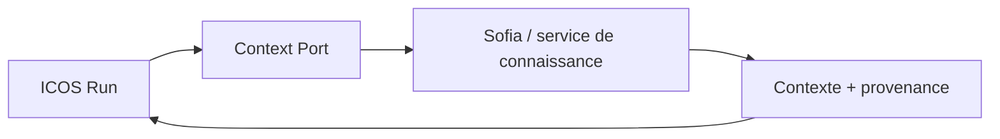

# icos-rag-memory

## Objectif

Définir une mémoire/RAG pour ICOS qui évite les défauts observés dans
Holding IA (Sofia) : dimensions d'embedding divergentes, provenance
insuffisante, schéma non reproductible entre Git et production, couplage
fort à Supabase/n8n. ICOS consomme la connaissance via un **Context Port** ;
la mémoire documentaire n'est jamais la source de vérité opérationnelle.

## Contexte d'utilisation

- Conception de la mémoire conversationnelle prévue en Phase 2 (feuille de
  route).
- Ajout d'une colonne ou d'une extension `pgvector`.
- Choix ou changement d'un fournisseur d'embedding.
- Définition des règles de fraîcheur, rétention, ou provenance d'un document
  retrouvé.

**Ne doit PAS s'activer quand** il s'agit de mécanique Postgres générique
sans dimension mémoire/embedding — schéma, migration, transaction non liée
à `pgvector` (→ `icos-postgresql`), ou pour faire de la mémoire une source
d'état métier autoritaire : cet usage n'est jamais couvert, quelle que soit
la compétence invoquée.

## Invariants ICOS

- ICOS ne stocke pas la connaissance métier/documentaire elle-même ; il
  consomme via un port de contexte (`Context Port`) qui interroge un service
  de mémoire séparé.

- La dimension vectorielle et le fournisseur d'embedding sont fixés par
  contrat dès la conception, jamais laissés diverger entre migration,
  script, et code applicatif.
- Toute donnée retrouvée porte une provenance (source, identifiant de
  document, version, date) journalisable par ICOS — sans qu'ICOS devienne la
  base documentaire.
- Un embedding manquant ou en échec ne doit jamais être silencieusement
  ignoré ou substitué par une valeur factice ; l'échec est explicite et
  observable.
- Le schéma exposé au Context Port est reproductible : ce qui est documenté
  dans le dépôt correspond exactement à ce qui existe en production (pas de
  divergence tolérée, cf. `icos-postgresql`).
- Toute extension `pgvector` respecte les invariants génériques de
  `icos-postgresql` (migration additive, mapping Zod, pas de modification de
  migration appliquée).

## Ce qu'elle doit vérifier avant d'agir

1. La dimension d'embedding est-elle fixée une seule fois et cohérente entre
   schéma, script d'ingestion, et requête de recherche ?
2. Le fournisseur d'embedding est-il derrière une interface remplaçable, ou
   codé en dur dans plusieurs endroits ?
3. Chaque résultat de recherche porte-t-il une provenance vérifiable
   (source, version, date) ?
4. Un embedding en échec produit-il une erreur explicite plutôt qu'une ligne
   avec vecteur NULL silencieux ?
5. Le service de mémoire reste-t-il séparé d'ICOS (pas de logique métier
   opérationnelle stockée dans la base documentaire) ?
6. Une règle de fraîcheur/péremption est-elle définie et testée, plutôt
   qu'implicite ?

## Technologies autorisées

Extension `pgvector` sous le PostgreSQL déjà utilisé par ICOS (pas de
seconde base de données). Fournisseur d'embedding à choisir explicitement
(décision nécessitant validation utilisateur si elle introduit une
dépendance externe significative — ex. API tierce payante). Graphiti :
aucune preuve d'usage dans Holding IA, évaluation à faire indépendamment sur
critères ICOS seuls ; introduction soumise à validation explicite (nouvelle
dépendance externe).

## Anti-patterns

Confirmés par l'audit Holding IA (Sofia) :

- Divergence de dimension vectorielle entre schéma (`vector(1024)`,
  Voyage-3) et décision documentée ailleurs (OpenAI `text-embedding-3-small`,
  1536 dimensions) — jamais acceptable dans ICOS.
- Embedding marqué comme sauté (`embedding_skipped: true`) ou NULL en
  production sans que le code appelant le sache.
- Nœud de pipeline faussement nommé « embedding » qui ne produit aucun
  vecteur réel (constaté dans un ancien workflow Sofia inactif).
- Filtre de fraîcheur incohérent avec le fournisseur d'ingestion réellement
  utilisé (référence à un fournisseur alors que l'ingestion récente en
  utilise un autre).
- Faire de la base documentaire la source d'état d'exécution d'ICOS (elle
  reste un fournisseur de contexte externe, jamais une autorité métier).
- Coupler directement le domaine ICOS à Supabase ou n8n pour la mémoire
  (violerait `icos-architecture` — l'intégration passe par un port).

## Sécurité

Aucun secret d'un fournisseur d'embedding tiers n'est copié depuis Holding
IA (cf. `icos-legacy-reuse` et `icos-security`). La provenance journalisée
ne doit jamais inclure de contenu sensible brut du document source au-delà
de ce qui est strictement nécessaire à la traçabilité.

## Stratégie TDD

- Test de cohérence de dimension vectorielle entre schéma et appel
  d'embedding, écrit avant l'implémentation du pipeline d'ingestion.
- Test explicite qu'un échec d'embedding est propagé comme erreur, pas
  silencieusement ignoré.
- Test de la règle de fraîcheur/péremption sur des cas limites (document
  juste expiré, juste valide).
- Test que le Context Port retourne toujours une provenance non vide pour
  tout résultat exploité par ICOS.

## Définition de done

- Schéma `pgvector` additif, validé par `icos-postgresql`.
- Fournisseur d'embedding unique et centralisé, testé.
- Aucune divergence de dimension entre composants.
- Provenance couverte par un test pour chaque chemin de retrieval.
