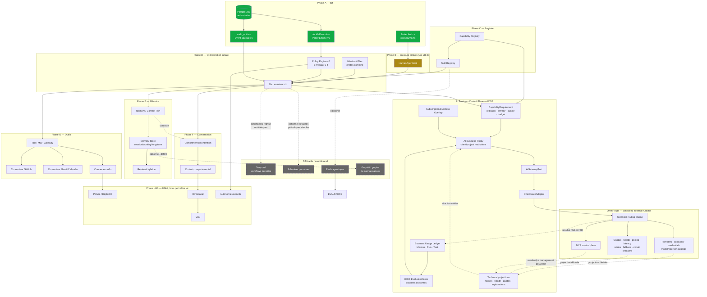
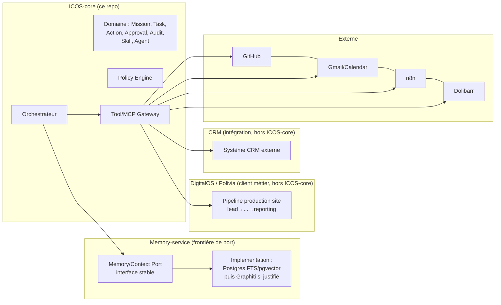

# Graphe de dépendances — composants futurs

> Répond aux décisions architecturales A-M de la mission : ordonnancement réel, prérequis vrais vs
> différables, limites de responsabilité entre ICOS-core / memory-service / DigitalOS / CRM /
> externe.

## 1. Graphe global



## 2. Prérequis vrais vs différables (décisions A-M)

### A. Registre Agent/Capability/Skill — quel ordre ?

**Capability avant Skill, Skill avant Orchestrateur.** Une `Capability` est une déclaration abstraite
("peut lire un email", "peut écrire du code") ; un `Skill` est une implémentation concrète et versionnée
de tout ou partie d'une capability, avec provenance et cycle de vie propre (Master Plan §9). L'orchestrateur
ne peut sélectionner un skill que si le registre de capabilities existe pour évaluer la compatibilité
(Master Plan §7.7 "compatibility"). **Prérequis vrai** : Capability Registry → Skill Registry →
sélection par l'Orchestrateur. Il n'existe aucun cas où l'ordre inverse a du sens : un skill sans
capability déclarée est un skill dont personne ne peut vérifier le périmètre d'autorité, ce qui
viole l'invariant "aucune skill n'a autorité sur les permissions" (Master Plan §4).

### B. Policy/Approval Engine — avant ou après l'Orchestrateur ?

**Avant, obligatoirement.** `decideExecution` existe déjà et fonctionne sans Orchestrateur (il est
appelé directement par les use cases Task/Action). L'extension vers 5 niveaux de risque (0-4) est
un prérequis vrai de l'Orchestrateur : un orchestrateur qui déciderait de déléguer une tâche à un
agent sans pouvoir évaluer le niveau de risque de chaque étape violerait l'invariant "aucun agent ne
contourne jamais le Policy Engine". **Séquence : Policy Engine v2 → Orchestrateur v1**, jamais l'inverse.

### C. Event Journal — extension avant ou après Orchestrateur ?

**Extension minimale avant, extension complète en parallèle.** Le schéma `eventType` actuel est un
`check` constraint SQL à 12 valeurs (`schema.ts`). Ajouter les événements `mission.created`,
`mission.transitioned`, `plan.generated`, `skill.invoked`, `skill.decided` est un prérequis
structurel avant que l'Orchestrateur puisse auditer ses propres décisions — mais l'extension complète
(tous les types d'événements de la Phase E/F) peut suivre en parallèle, additive, sans bloquer.

### D. RAG / Graphiti — prérequis de l'Orchestrateur ?

**Non — différable.** L'Orchestrateur v1 peut fonctionner avec un contexte minimal (Mission +
Task + historique d'audit direct), sans mémoire à long terme ni retrieval hybride. Le Master Plan
lui-même distingue Memory (§11) de l'exécution (§16) comme deux couches séparées. **Graphiti (graphe
de connaissances) est explicitly différable au-delà de la Phase E** — un simple stockage
texte+métadonnées (PostgreSQL FTS ou pgvector) suffit pour la première itération de mémoire ; un
graphe de connaissances n'est justifié que lorsque les relations entre entités mémorisées
(client↔dossier↔décision↔personne) deviennent elles-mêmes une donnée interrogée activement — pas
avant Phase H (Polivia/DigitalOS) où ce besoin apparaît concrètement.

### E. Orchestrateur — quel périmètre "premier ICOS" ?

**Orchestrateur v1 = décomposition Mission → Task[] + sélection agent + application Policy Engine +
audit, SANS reprise multi-étapes complexe.** Voir [11-first-autonomous-icos.md](./11-first-autonomous-icos.md).

### F. ICOS-core / memory-service / DigitalOS / CRM / externe — limites



**Règle de frontière** : ICOS-core ne connaît jamais directement DigitalOS, un CRM ou un outil
externe — uniquement le Tool/MCP Gateway, qui les expose comme des capacités interchangeables
derrière une interface stable. Le memory-service est un port, pas une base de code partagée : son
implémentation peut changer (Postgres → Postgres+Graphiti) sans que le domaine ICOS-core le sache.

### G. Postgres relationnel / FTS / pgvector / Graphiti / Neo4j — quand quoi ?

| Besoin | Solution | Quand |
|---|---|---|
| Vérité métier (Mission, Task, Skill, Approval...) | Postgres relationnel | Toujours, dès le début |
| Recherche texte dans mémoire/notes | Postgres FTS (`tsvector`) | Phase E, dès l'ouverture de la mémoire |
| Similarité sémantique (retrieval RAG) | pgvector | Phase E, si le FTS seul ne suffit pas empiriquement |
| Relations riches entre entités mémorisées | Graphiti (ou équivalent) | Phase H+, seulement si un besoin produit concret l'exige (ex. DigitalOS reliant client↔projet↔décisions) |
| Graphe de connaissances généraliste séparé (Neo4j dédié) | Neo4j | Non retenu à ce stade — Graphiti peut s'appuyer sur Postgres ou un store dédié ; l'introduction d'un SGBD supplémentaire n'est pas justifiée tant que Graphiti/pgvector suffisent |

**Décision** : ne pas introduire Neo4j indépendamment de Graphiti. Si Graphiti est retenu (Phase
H+), son store interne est un détail d'implémentation du memory-service, pas une nouvelle
dépendance visible du domaine.

### H. Données authoritatives vs dérivées

| Authoritative (Postgres, jamais recalculée à partir d'ailleurs) | Dérivée (peut être reconstruite, cache, index) |
|---|---|
| Mission, Task, Action, Approval, Audit, Skill (registre), Agent, HumanAgentLink | Index FTS/pgvector sur la mémoire |
| Décisions du Policy Engine (résultat historisé) | Traces d'exécution technique (EventBus interne) |
| Historique des versions de skill activées | Résumés de mémoire long-terme (recalculables depuis les sources) |
| Policies IA métier : criticité, privacy class, qualité minimale, budget, restrictions client/projet, classes de providers et règles métier de fallback | Projections/cache ICOS des catalogues, quotas, health, latence et routing explanations OmniRoute |
| Business metadata d'abonnement : propriétaire, centre de coût, contrat client, préférence abonnement/crédits/free tier | Provider accounts, credentials/OAuth, catalogues provider/modèle/free-tier, fenêtres de reset et pricing technique — source de vérité OmniRoute |
| `UsageLedger` métier corrélé Mission/Run/Task et coûts qualifiés (`estimatedListCost`, `providerReportedCost`, `subscriptionIncludedCost`, `incrementalCost`, `savingsEstimate`) | Télémétrie technique brute provider/modèle/compte/tokens/coût/latence/fallback retournée par OmniRoute |
| Résultats d'evals métier ICOS | Evals de routing/modèle OmniRoute et agrégats techniques |

### I. Temporal — avant ou après le premier orchestrateur ?

**Après, et seulement si nécessaire.** Voir invariant 3. Le premier orchestrateur (Phase D) gère des
missions à faible profondeur (quelques tâches séquentielles ou parallèles simples) sans besoin de
reprise durable complexe — un enregistrement d'état en base (statut de Mission/Task + audit) suffit
pour la reprise, car **PostgreSQL est déjà la source de vérité de l'état**. Temporal (ou équivalent)
n'est introduit que lorsqu'apparaît un besoin concret de : sagas longues avec compensation,
attente d'événements externes asynchrones sur des durées non bornées, ou parallélisme complexe avec
retry différencié par étape — probablement à partir de la Phase H (pipeline Polivia multi-semaines).

### J. MCP pour tous les outils, ou seulement certains ?

**MCP comme protocole par défaut pour toute nouvelle intégration externe, mais pas comme exigence
rétroactive.** Le Tool/MCP Gateway (Phase G) expose les connecteurs (GitHub, Gmail, n8n...) via MCP
lorsque c'est le mode d'intégration natif de l'outil ; pour des appels internes à ICOS-core (ex.
lecture d'un Task existant), passer par MCP ajouterait une indirection sans bénéfice — ces appels
restent des appels de méthode directs sur les ports internes. **Règle** : MCP est le protocole
d'intégration pour tout ce qui est *externe au domaine ICOS*, jamais pour la communication
intra-domaine.

### K. Frontière AI Gateway ICOS / OmniRoute v3.8.49

**Principe : ICOS = WHY / WHAT / BUSINESS CONSTRAINTS ; OmniRoute = HOW / WHERE / TECHNICAL
ROUTING.** OmniRoute est un runtime externe stratégique, piloté mais non reconstruit par ICOS.

#### Classification explicite des composants

| Composant proposé | Classe | Responsabilité finale |
|---|---|---|
| `ProviderRegistry` | **D — pure OmniRoute** pour le registre technique ; **B — overlay ICOS** pour restrictions métier par classe/provider | OmniRoute possède providers, comptes, API keys/OAuth et catalogue. ICOS conserve seulement `omnirouteConnectionId`, ownership, enabled-for-business et restrictions client/projet. |
| `ModelRegistry` | **D — pure OmniRoute** pour le catalogue ; **C — projection/cache ICOS** si besoin d'UI/réaction | Les modèles et leurs capacités techniques sont synchronisés par OmniRoute. ICOS peut cacher un snapshot daté, jamais en faire une seconde vérité. |
| `CapabilityRegistry` | **A — authoritative ICOS** pour capabilities métier/skills ; **C** pour capabilities techniques observées | Une tâche exprime `CapabilityRequirement`; le mapping vers modèles est résolu par OmniRoute. |
| `SubscriptionRegistry` | **B — business overlay ICOS** | Propriétaire, centre de coût, contrat client, préférence abonnement/crédits/free tier. Les comptes, quotas et reset windows restent OmniRoute. |
| `UsageLedger` | **A — authoritative ICOS** pour la corrélation métier ; télémétrie source **D OmniRoute** | Corrèle Mission/Run/Task au provider/modèle/compte réel et distingue coûts estimés, rapportés, inclus, incrémentaux et économies estimées. |
| `ModelPolicy` | **B — business overlay ICOS** | Qualité minimale, privacy, criticité, budget, restrictions et fallback métier. |
| `ModelRouter` | **D — pure OmniRoute** pour le scoring/routage ; son ancien nom côté ICOS disparaît au profit d'`AiRoutingPolicy` | ICOS choisit les contraintes/preset (`quality-first`, `cheap`, `fast`, `coding`, budget strict, fallback on/off) ; OmniRoute choisit route/provider/modèle/compte. |
| `ModelHealthMonitor` | **D — pure OmniRoute** ; **C — projection ICOS** | OmniRoute mesure health, quota, latency, lockout et circuit state. ICOS peut réagir métier à une projection fraîche. |
| `EvaluationStore` | **A — authoritative ICOS** pour outcomes métier ; evals techniques **D OmniRoute** | OmniRoute mesure routing/modèle ; ICOS mesure résultat métier correct, conforme et accepté. |
| `OmniRouteAdapter` | **B — frontière d'infrastructure ICOS** | Implémente `AiGatewayPort`, traduit les contraintes et normalise résultat/télémétrie. |

`AiGatewayPort` est l'abstraction propre à ICOS et conserve une remplaçabilité théorique. OmniRoute
reste néanmoins la cible principale et unique en production prévue. ICOS ne forke pas OmniRoute, ne
copie pas son runtime, ne duplique ni credentials, catalogues, quota engine, circuit breakers ni
fallback technique.

#### Flux cible par requête

```text
Task
→ CapabilityRequirement
→ BusinessCriticality
→ PrivacyClass
→ QualityThreshold
→ Budget
→ AllowedProviderClasses
→ SubscriptionPreference
→ AiRoutingPolicy (business)
→ AiGatewayPort / OmniRouteAdapter
→ OmniRoute (technical routing)
→ provider / model / account réel
→ AiGenerationResult + routing explanation + telemetry
```

NVIDIA NIM reste un provider géré par OmniRoute. Ses dialectes OpenAI-/Anthropic-compatible sont un
détail d'infrastructure sans impact sur le domaine.

#### D3 minimal puis extensions

1. **D3** : `AiGatewayPort`, `OmniRouteAdapter`, `CapabilityRequirement`, `AiRoutingPolicy` minimal,
   restrictions métier, corrélation usage/résultat et contrat de fallback sûr. Aucun registre ou
   routeur technique ICOS.
2. **R1** : business routing policy, metadata d'abonnement/budget et UsageLedger métier qualifié.
3. **R2** : consommation des projections/API/MCP OmniRoute pour health/quota/latence/route
   explanation ; définition des réactions métier, pas de monitor ni circuit breaker maison.
4. **R3** : evals métier ICOS transformées en contraintes/policy proposées à OmniRoute, avec contrôle
   humain pour toute policy critique.

#### Coûts, retry, MCP et sécurité

- Un coût OmniRoute n'est pas présumé facturé. Le ledger distingue `estimatedListCost`,
  `providerReportedCost`, `subscriptionIncludedCost`, `incrementalCost` et `savingsEstimate`.
- OmniRoute retry/fallback = retry d'inférence. ICOS/Temporal retry = retry d'activité métier.
  `ModelGeneration` produit une proposition persistée ; `ExternalExecution` possède
  `ExecutionRecord` + `idempotencyKey` + effet.
- Le MCP OmniRoute peut exposer health, quotas, modèles, métriques, explications, budgets et
  configuration. Les tools read-only et write sont séparés ; tout management write passe par les
  permissions et Policy/Approval ICOS. MCP reste un protocole, jamais une permission.
- Les défenses OmniRoute (chiffrement credentials, secret/PII scanning, injection/SSRF, rate limits,
  scopes MCP, sandbox/guardrails) sont de la défense en profondeur. Un guardrail fail-open ne peut
  jamais autoriser une action à la frontière ICOS.
- OmniRoute Memory sert le contexte d'inférence ; ICOS Memory sert clients, projets, missions, faits,
  décisions et organisation. OmniRoute skills/pipelines/scheduler ne remplacent ni Skill Registry,
  workflow métier ni Temporal ICOS.

### L. Placement des hooks

Les hooks (Master Plan : WHEN) interceptent des transitions métier (ex. avant exécution d'une
action sensible, après décision d'approbation) — ils s'accrochent sur le Policy Engine et l'Event
Journal, jamais directement sur les connecteurs externes. Un hook ne doit jamais pouvoir contourner
`decideExecution` ; il s'exécute *dans* le flux gouverné, pas en parallèle non gouverné.

### M. Garanties contre les scénarios de risque

| Risque | Garantie architecturale | Où elle est appliquée |
|---|---|---|
| Auto-élévation d'un agent | Interdiction structurelle : aucune API n'autorise un agent à modifier `authorizationLevel`, le sien ou celui d'un autre agent ; seul un humain avec permission `agents.manage` le peut | Policy Engine + permission matrix existante |
| Outil hors politique | Tout appel passe par le Tool/MCP Gateway qui invoque le Policy Engine avant exécution, jamais après | Tool/MCP Gateway (Phase G) |
| Double exécution | `idempotencyKey` sur toute action déclenchant un effet externe (leçon Holding IA, voir [07](./07-reuse-mapping.md)) + contrainte unique en base | Action / futur ExecutionRecord |
| Action tardive après rejet | `Approval.decision = rejected` est terminal (déjà vrai) ; le Tool/MCP Gateway revérifie le statut d'approbation juste avant exécution, jamais seulement au moment de la planification | Policy Engine + Gateway |
| Mémoire confondue avec vérité | Toute lecture mémoire porte une provenance ; le Policy Engine et le domaine ne lisent jamais la mémoire comme source d'autorisation | Memory/Context Port (Phase E) |
| Perte d'état sur crash | État de Mission/Task/Action toujours en Postgres avant tout effet externe ; reprise = relecture d'état, pas de mémoire volatile critique | Orchestrateur v1 + Postgres |
| Mission non stoppable | Statut `cancelled` propagé : une Mission annulée doit interrompre toute Task non terminale associée (extension du pattern déjà existant sur `Task`) | Domaine Mission (Phase D) |
| Agent choisissant un provider ou accédant à une clé | Aucun port provider exposé ; l'agent fournit des requirements métier à `AiGatewayPort`, OmniRoute résout credentials/provider/modèle/compte | AI business policy + `OmniRouteAdapter` |
| Fallback incompatible avec la confidentialité | ICOS exprime classes autorisées et fallback métier ; OmniRoute ne route que dans cette enveloppe. Aucun candidat = refus explicite | `AiRoutingPolicy` ICOS + OmniRoute |
| Double action externe après retry/fallback modèle | Séparation génération/exécution + `ExecutionRecord` et `idempotencyKey` uniques ; le retry modèle ne possède aucune capacité d'effet externe | Orchestrateur + Tool/MCP Gateway |
| MCP confondu avec permission | MCP transporte l'appel ; Policy/Approval décide s'il est permis. Aucun metadata MCP ne vaut autorisation | Tool/MCP Gateway + Policy Engine |
| Heartbeat confondu avec autorité | Le heartbeat ne fait que réévaluer et proposer/planifier ; chaque action reste soumise à Policy/Approval | Proactivity Engine |

## 3. Dépendances OpenJarvis à conserver comme patterns, jamais comme runtime

Les exigences OpenJarvis ont été relues et sont intégrées au graphe et aux futurs lots. OpenJarvis
est une **source comparative de contrats et de tests**, pas un runtime ICOS et pas un changement de
stack. La classification détaillée sera portée par [07-reuse-mapping.md](./07-reuse-mapping.md), avec
les frontières obligatoires suivantes :

| Pattern à auditer | Dépendance/prérequis ICOS | Frontière à ne pas franchir |
|---|---|---|
| `SkillManager`, manifests, trust/provenance | Capability Registry → Skill Registry | Une skill n'accorde jamais permission ou autorité |
| Skill discovery from traces | Traces + `EvaluationStore` → `SkillCandidate` | Succès répétés ≠ auto-installation/activation |
| `MemoryBackend`, retrieval hybride | Memory/Context Port → FTS, puis pgvector si mesure | Memory ≠ état authoritative |
| `ProactiveAgent`, heartbeat | Mission/Task/Approval query ports + scheduler simple | Heartbeat ≠ autorité ; Policy/Approval toujours appliqué |
| `ApprovalStore`, permission memory | Policy/Approval Engine + Event Journal | Une mémoire d'approbation ne remplace pas la décision authoritative/versionnée |
| Scheduler persistant | Proactivity Engine | Scheduler ≠ Temporal ; aucun remplacement automatique |
| MCP adapters/providers | Tool/MCP Gateway | MCP ≠ permission model |
| Model routing | AI Runtime Control Plane → OmniRoute | ICOS pilote OmniRoute ; OpenJarvis n'est ni routeur ni runtime |
| EventBus + traces | Observabilité technique | EventBus ≠ Event Journal immuable |
| Evals | `EvaluationStore` + corpus versionné | Score observé ≠ changement automatique de policy |
| Channel adapters | Phase I : WhatsApp, Telegram, voix | Adapters uniquement ; aucune logique/policy propre au canal |
| Security scanners/sandbox | Skill review + Tool Gateway | Sandbox renforce la policy, ne la remplace pas |

Le cycle de self-improvement accepté est strictement gouverné :

```text
comportement répété avec succès
→ SkillCandidate
→ preuves/provenance
→ evals reproductibles
→ revue sécurité
→ approbation humaine
→ activation versionnée
```

Il n'existe **aucun** chemin d'auto-installation, d'auto-approbation ou d'auto-activation. Le moteur de
proactivité peut réévaluer périodiquement missions, tâches, deadlines, approbations en attente,
échecs et follow-ups ; il ne peut produire que des observations, propositions ou commandes qui
repassent par les mêmes portes Policy/Approval que toute autre origine.
