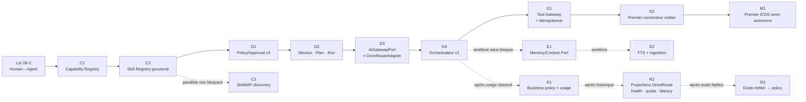
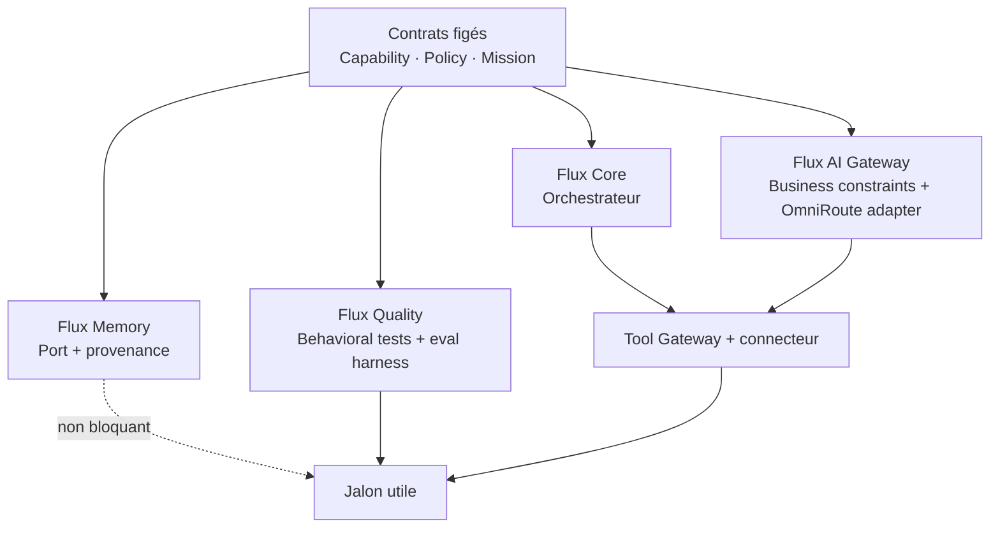

# Chemin critique vers un ICOS utile et gouverné

> Le chemin critique part de l'état réel au 23 juillet 2026. Le Lot 2B-2 reste en cours dans un autre
> worktree et n'est ni modifié ni redéfini ici.

## 1. Chemin critique recommandé

Le chemin critique minimal est :

> **gouvernance humain-agent → capabilities → skills → politique → mission/run → accès modèle via
> OmniRoute → orchestration → exécution externe idempotente → premier scénario métier.**

La mémoire avancée, Temporal, Graphiti, l'omnicanal et le routage fondé sur les evals ne sont pas des
prérequis du premier scénario utile.

## 2. Pourquoi X doit précéder Y

1. **Lot 2B-2 avant sélection d'agent**, parce que l'orchestrateur doit connaître la relation autorisée
   entre humain et agent avant toute délégation.
2. **Capability Registry avant Skill Registry**, parce qu'une skill sans capability déclarée ne peut
   être ni comparée, ni contrôlée, ni sélectionnée de manière sûre.
3. **Skill Registry avant Orchestrateur**, parce que le planificateur ne doit jamais improviser un
   moyen d'exécution hors inventaire versionné et activé.
4. **Policy/Approval v2 avant Orchestrateur**, parce qu'une décomposition autonome sans classification
   de chaque action crée un chemin de contournement de `decideExecution`.
5. **Mission/Plan/Run avant Orchestrateur**, parce que la reprise, l'arrêt et l'audit exigent un état
   authoritative distinct de la conversation et de la mémoire.
6. **`AiGatewayPort` et `OmniRouteAdapter` avant le premier appel IA de l'Orchestrateur**, parce
   qu'aucun agent ne doit recevoir de credential provider ni créer un accès direct. Les catalogues,
   comptes, credentials et routes techniques restent authoritative dans OmniRoute ; D3 ne les
   reconstruit pas.
7. **Orchestrateur avant Tool Gateway**, au sens de la sélection/décomposition ; mais le Gateway doit
   exister avant tout **effet externe**, parce que lui seul unifie policy, approval, idempotence et
   journalisation d'exécution.
8. **ExecutionRecord/idempotence avant fallback de modèle**, parce qu'un retry de génération ne doit
   jamais pouvoir déclencher deux fois une action externe.
9. **UsageLedger métier avant politique économique avancée**, parce que l'usage technique OmniRoute
   doit être corrélé à Mission/Run/Task et distingué entre coût estimé, rapporté, inclus et
   incrémental avant toute décision business.
10. **Projection fraîche de health/quota OmniRoute avant réaction métier**, parce qu'ICOS ne doit ni
    mesurer une seconde fois ni faire tourner son propre circuit breaker. OmniRoute conserve le
    fallback technique ; ICOS détermine seulement s'il est métierement permis.
11. **EvaluationStore ICOS et corpus versionnés avant adaptation de policy**, parce que les evals
    OmniRoute mesurent route/modèle alors qu'ICOS doit prouver la réussite métier.
12. **État Mission/Task en PostgreSQL avant heartbeat**, parce que la proactivité ne doit jamais
    dépendre d'une mémoire volatile ni inventer l'état à réévaluer.
13. **Traces + evals + revue sécurité avant `SkillCandidate` activable**, parce que le
    self-improvement est une chaîne gouvernée, jamais de l'auto-installation.

## 3. Ce qui est réellement bloquant pour le premier jalon

| Composant | Bloquant ? | Justification |
|---|---:|---|
| Lot 2B-2 | Oui | Autorité humain↔agent avant délégation |
| Capability Registry | Oui | Contrat de ce qui peut être fait |
| Skill Registry minimal | Oui | Contrat versionné de comment le faire |
| Policy/Approval v2 minimal | Oui | Classification et décision fail-closed |
| Mission/Plan/Run | Oui | État durable, arrêt, reprise, audit |
| `AiGatewayPort` + `CapabilityRequirement` + policy minimale | Oui | Exprimer les contraintes ICOS sans dupliquer le routing |
| OmniRouteAdapter | Oui | OmniRoute reste l'unique runtime multi-provider et la vérité technique |
| SkillsMP Discovery | Non | Une skill native active suffit ; C3 avance en parallèle après C2 |
| Orchestrateur v1 | Oui | Décomposition et coordination |
| Tool Gateway + ExecutionRecord | Oui pour effet externe | Policy juste avant effet + idempotence |
| Premier connecteur métier | Oui | Sans effet métier contrôlé, le système reste une démo |
| Mémoire long terme / RAG | Non | Le premier dossier peut utiliser des données explicitement fournies |
| pgvector / Graphiti | Non | Optimisation de retrieval, pas prérequis fonctionnel |
| Temporal | Non | PostgreSQL suffit pour un run court et peu profond |
| Scheduler / heartbeat | Non | Proactivité périodique ultérieure |
| Multi-provider dynamique | Non | OmniRoute peut initialement exposer un seul choix autorisé |
| Health/quota-aware fallback | Non | Nécessaire avant exploitation multi-source robuste, pas avant v1 |
| Eval-based routing | Non | Nécessite un historique d'évaluation |
| WhatsApp / Telegram / voix | Non | Le cockpit web suffit au premier jalon |

## 4. Sous-chemins parallélisables sans casser le chemin critique

Après stabilisation des contrats de C1/D1/D2, quatre flux peuvent progresser en parallèle :

Les règles détaillées de parallélisation sont dans
[12-parallelization.md](./12-parallelization.md). Aucun flux parallèle ne doit modifier les mêmes
contrats de domaine sans synchronisation préalable.

## 5. Technologies explicitement différées

- **pgvector** : uniquement après mesure montrant que FTS + filtres de metadata ne suffit pas.
- **Graphiti / Neo4j** : Phase H+, seulement pour un besoin relationnel métier démontré.
- **Temporal** : seulement pour workflow durable long, attente externe non bornée, saga/compensation
  ou parallélisme avec retry d'étape complexe.
- **Nouveau scheduler** : après le moteur de proactivité ; sa présence ne justifie pas Temporal.
- **Eval-based routing avancé** : après EvaluationStore, corpus versionné et résultats comparables.
- **Sandbox d'exécution sophistiqué** : introduit avec les premières skills exécutant du code non
  trivial ; les scanners de sécurité et la revue de provenance arrivent plus tôt.
- **Omnicanal/voix** : après stabilité du contrat conversationnel et des commandes canal-agnostiques.

## 6. Point de sortie du chemin critique

Le chemin critique se termine lorsque le scénario défini dans
[11-first-autonomous-icos.md](./11-first-autonomous-icos.md) réussit de bout en bout : instruction
naturelle, Mission durable, plan inspectable, choix agent/skill/modèle gouverné, préparation d'une
action, approbation si requise, effet externe idempotent, vérification, résultat, audit complet et
reprise après interruption. Il ne se termine ni au premier appel LLM, ni à la première génération de
texte, ni à la seule création d'une Task.
