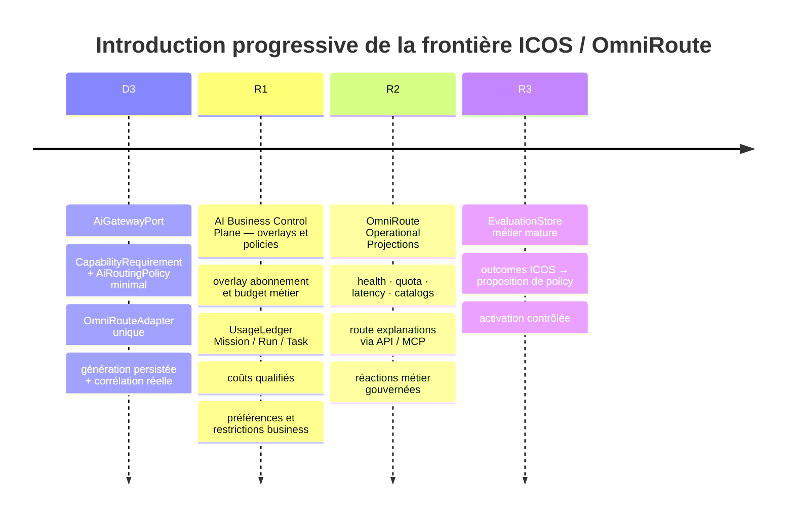

# Calendrier d'introduction des technologies

> Principe : introduire une technologie lorsque le problème qu'elle résout existe et est mesurable,
> non parce qu'elle figure dans une vision cible. Chaque ligne donne le problème, l'alternative plus
> simple, le déclencheur et le coût.

## 1. Matrice de décision

| Technologie / composant            | Problème résolu                                                                                                                         | Alternative plus simple                       | Moment optimal / déclencheur                                                          | Coût et complexité                                                              |
| ---------------------------------- | --------------------------------------------------------------------------------------------------------------------------------------- | --------------------------------------------- | ------------------------------------------------------------------------------------- | ------------------------------------------------------------------------------- |
| PostgreSQL relationnel             | État métier durable, transactions, contraintes, journal append-only                                                                     | Backend mémoire pour tests seulement          | Déjà en place ; toutes les entités authoritatives futures y vivent                    | Faible incrémental, maîtrisé                                                    |
| Postgres FTS (`tsvector`)          | Recherche lexicale dans documents/mémoire                                                                                               | `ILIKE`, scan en mémoire                      | E2, dès que l'ingestion de documents existe                                           | Faible, aucune nouvelle infrastructure                                          |
| pgvector                           | Similarité sémantique                                                                                                                   | FTS + filtres metadata                        | E3, seulement si un benchmark montre des échecs pertinents de FTS                     | Moyen : extension, embeddings, index et réindexation                            |
| Graphiti / graphe de connaissances | Recherche de relations temporelles riches                                                                                               | Tables relationnelles + FTS/pgvector          | H+, si des questions client↔projet↔décision sont impossibles ou coûteuses autrement   | Élevé : modèle dérivé, synchronisation, qualité des extractions                 |
| Neo4j séparé                       | Store de graphe dédié                                                                                                                   | Graphiti sur store existant / SQL relationnel | Non retenu sans preuve qu'un store dédié est indispensable                            | Très élevé : nouvelle base, opérations, cohérence                               |
| EventBus interne                   | Découpler télémétrie/traces et abonnés techniques                                                                                       | Appels directs / hooks synchrones             | D4 ou Q1, lorsque plusieurs consommateurs observent Run/inference/tool events         | Faible à moyen ; ne remplace jamais `audit_entries`                             |
| Event Journal étendu               | Prouver les décisions et reconstruire une chronologie métier                                                                            | Logs applicatifs                              | Additif à chaque lot de domaine, avant que le nouveau comportement soit activé        | Faible ; contrainte CHECK à migrer avec soin                                    |
| Scheduler persistant               | Exécuter cron/interval/once et heartbeat                                                                                                | Cron OS + endpoint interne                    | S1, après P1 ; lorsque la proactivité périodique est validée                          | Moyen ; leasing/lock distribué et anti-double-run requis                        |
| Temporal                           | Workflows durables, timers non bornés, sagas et compensation                                                                            | États Mission/Run en PostgreSQL + worker      | H+ uniquement si seuil ADR-0012 franchi                                               | Élevé : service externe, SDK, opérabilité et nouveau modèle mental              |
| MCP                                | Protocole uniforme pour outils externes                                                                                                 | Adapter HTTP/SDK derrière le Gateway          | G1 par défaut pour les intégrations qui le supportent ; pas pour appels intra-domaine | Moyen ; MCP ne transporte aucune autorité                                       |
| n8n                                | Automatisations périphériques et connecteurs existants                                                                                  | Connecteur ICOS direct                        | G2/H+, uniquement derrière Tool Gateway                                               | Moyen ; jamais orchestrateur central                                            |
| OmniRoute                          | Providers/comptes/credentials, catalogues, quotas, health, pricing, circuit breakers, retries/fallback, routing et protocol translation | Connexion directe à un provider               | D3, avant le premier appel modèle orchestré                                           | Runtime externe stratégique durable ; source de vérité technique                |
| AI Business Control Plane ICOS     | Exprimer requirements, criticité, confidentialité, budget, restrictions, préférences et outcomes métier                                 | Configuration statique d'une policy           | Fondation D3, puis R1-R3                                                              | Faible à moyen : overlays métier et projections, aucun moteur de routing maison |
| OpenJarvis runtime                 | Ensemble intégré agents/memory/scheduler/channels                                                                                       | Extraire seulement contrats/patterns          | Jamais                                                                                | Rejeté : changement de stack, gouvernance incompatible                          |
| Evals agentiques                   | Mesurer comportement, non-régression et qualité modèle/skill                                                                            | Tests déterministes unitaires seuls           | Q1 dès D4 ; R3 après corpus et historique suffisants                                  | Moyen ; jeux de données, reproductibilité et coûts d'inférence                  |
| Sandbox skills                     | Isoler code ou outils non fiables                                                                                                       | Skills natives revues, outils allowlistés     | Avant la première skill exécutant du code non natif                                   | Moyen à élevé selon niveau d'isolation                                          |
| Channel adapters                   | Ajouter WhatsApp/Telegram/voix sans contaminer le domaine                                                                               | Cockpit web                                   | I1+, après contrat conversationnel et Gateway stables                                 | Moyen par canal ; secrets, webhooks, retries                                    |
| Twilio Conversation Intelligence   | Analyse voix/conversation                                                                                                               | Transcription et journalisation simples       | J+, seulement après expérience voix validée                                           | Coût fournisseur, confidentialité et rétention                                  |
| Mem0                               | Mémoire contextuelle long terme, retrieval sémantique, personnalisation                                                                 | Postgres FTS seul                             | E1+ si FTS ne suffit plus pour le contexte conversationnel ; port abstrait            | Moyen ; adapter isolé, données non authoritative                                |
| Graphiti                           | Relations temporelles riches, évolution d'entités, provenance relationnelle                                                             | PostgreSQL relationnel                        | H+ seulement, si besoins relationnels complexes démontrés                             | Élevé ; nouveau store dérivé, synchronisation                                   |
| Browser Use                        | Automatisation navigateur, extraction, navigation autonome                                                                              | Appels API directs / outils existants         | E2+ ; BrowserPort abstrait, policy ICOS pour permissions/domaines                     | Moyen ; secrets browser, webhooks                                               |
| OpenHands                          | Coding-agent backend spécialisé, exécution tâches de développement                                                                      | Scripts manuels ou Claude Code direct         | E3+ ; DevelopmentGateway abstrait, repo autorisés, merge approval ICOS                | Moyen ; sandbox requis, coût                                                    |
| E2B                                | Sandbox externe isolé, exécution code non fiable                                                                                        | Docker local ou pas de sandbox                | E4+ ; SandboxPort, sélection par risque/coût/confidentialité                          | Moyen ; nouveau service externe                                                 |
| Langfuse                           | Observabilité IA : tracing LLM, prompt telemetry, evals, token/cost tracking                                                            | Logs applicatifs / traces dispersées          | E5+ ; ObservabilityPort, pas business DB                                              | Moyen ; nouveau service externe                                                 |

## 2. Chronologie AI Runtime / OmniRoute

### D3 — Fondation minimale, pas reconstruction

D3 introduit `AiGatewayPort`, `CapabilityRequirement`, une `AiRoutingPolicy` métier minimale et
`OmniRouteAdapter`. Il ne crée ni ProviderRegistry/ModelRegistry techniques, ni moteur de health,
quota, circuit breaker, retry ou fallback : OmniRoute v3.8.49 possède déjà ces fonctions et en reste
la source de vérité.

Les providers — Anthropic/Claude, OpenAI/Codex, NVIDIA APIs/NIM, modèles locaux et futurs — sont
gérés derrière OmniRoute. Les dialectes OpenAI-/Anthropic-compatible de NVIDIA NIM sont absorbés par
ce runtime externe ; le domaine ICOS ne change jamais.

### R1 — Économie et politique métier

R1 ajoute ownership, centre de coût, contraintes client/projet, préférence abonnement/crédits/free
tier et budget métier. Le `UsageLedger` corrèle la télémétrie OmniRoute avec Mission/Run/Task et
qualifie les montants : `estimatedListCost`, `providerReportedCost`,
`subscriptionIncludedCost`, `incrementalCost`, `savingsEstimate`. Un coût estimé n'est jamais assimilé
automatiquement à une facture.

ICOS exprime les seuils et préférences ; OmniRoute applique techniquement la stratégie et choisit
provider/modèle/compte selon catalogues, quotas, health, coût et latence.

### R2 — Projections opérationnelles, pas moteur maison

R2 consomme les API ou le MCP OmniRoute pour health, quotas, reset windows, modèles, métriques,
route explanations et budgets. ICOS peut cacher une projection datée et déclencher une réaction
métier — pause, refus, notification, réduction de budget — mais ne duplique ni monitor, lockout,
circuit breaker, retry ou fallback technique. Les outils MCP read-only et write sont séparés ; les
writes passent par Policy/permissions ICOS.

### R3 — Qualité métier observée

Les evals OmniRoute mesurent routage et aptitude modèle. Les evals ICOS mesurent réussite métier.
R3 transforme des outcomes ICOS versionnés en propositions de seuils/préférences pour OmniRoute ; il
ne maintient pas de mapping technique query→model. Toute policy critique reste soumise à contrôle
humain.

## 3. Chronologie mémoire

1. **E1 — port et metadata** : contrat `store/retrieve/delete`, source, confiance, date, validité,
   scope, correctibilité ; mémoire explicitement non-authoritative.
2. **E2 — ingestion et Postgres FTS** : chunking, provenance par chunk, retrieval lexical.
3. **E3 — pgvector conditionnel** : embeddings via AI Runtime, benchmark FTS vs hybride, RRF si gain
   mesuré.
4. **E4 — Graphiti conditionnel** : seulement pour relations temporelles riches impossibles à
   servir proprement avec PostgreSQL.

## 4. Chronologie workflows et proactivité

1. D2/D4 : reprise simple depuis Mission/Run en PostgreSQL.
2. P1 : heartbeat lit missions, tâches, deadlines, approvals, failures et follow-ups ; il propose ou
   déclenche une commande gouvernée, sans autorité propre.
3. S1 : scheduler persistant avec lease/idempotence, pour cron/interval/once.
4. T1 conditionnel : Temporal uniquement si l'orchestration longue dépasse les garanties du couple
   PostgreSQL + scheduler.

## 5. Chronologie qualité et self-improvement

1. Q1 : tests comportementaux et EvaluationStore minimal.
2. Traces techniques : provider/modèle/skill/outils, coûts, latence, résultat vérifié.
3. Q2 : détection de comportements répétés → `SkillCandidate` quarantainé.
4. Evals reproductibles + revue sécurité humaine.
5. Approbation humaine et activation versionnée.
6. K1 : autonomie avancée seulement après ce cycle.

Aucune étape n'autorise auto-installation, auto-activation, auto-approbation ou modification autonome
des guardrails.
