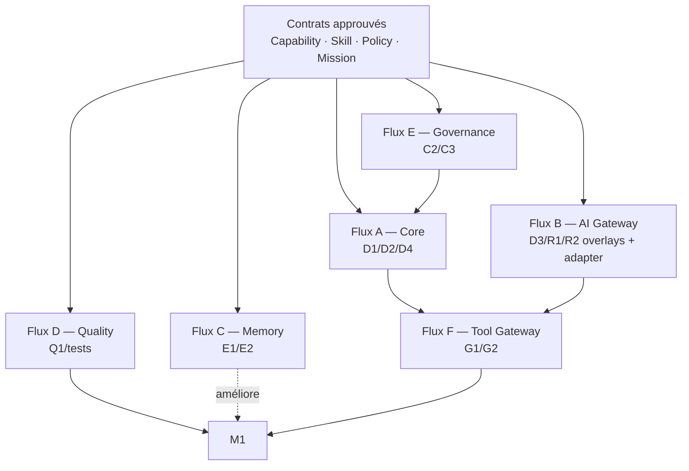

# Opportunités de parallélisation

> Objectif : permettre à plusieurs Claude Code de travailler sans conflits de fichiers, de contrats
> ni de migration. La parallélisation commence uniquement après stabilisation des interfaces
> partagées et validation humaine du plan de lots.

## 1. Principe général

Les travaux sont parallélisables s'ils :

1. ne modifient pas la même entité domaine ou le même port ;
2. n'ajoutent pas des valeurs concurrentes au même check constraint SQL ;
3. ne touchent pas le même fichier de composition root sans coordination ;
4. peuvent être testés avec un fake/stub du contrat amont ;
5. disposent d'un ordre de fusion explicite.

## 2. Vagues de travail

### Vague 0 — Prérequis séquentiel

| Lot  | Raison non parallélisable                                |
| ---- | -------------------------------------------------------- |
| 2B-2 | En cours ailleurs ; pose la gouvernance humain↔agent     |
| C1   | Définit le vocabulaire partagé Capability                |
| C2   | Dépend de C1 et définit le contrat Skill utilisé ensuite |

### Vague 1 — Après C1/C2

Trois flux peuvent démarrer :

- **Flux Core Policy** : D1 (Policy Engine v2), puis D2 (Mission/Plan/Run).
- **Flux Skill Discovery** : C3 (SkillsMP read-only), exclusivement dans les adapters/registre.
- **Flux Quality** : Q1 prépare le harness et encode les CAS 1-24 avec fakes des ports futurs.

D1 et C3 ne doivent pas toucher les mêmes fichiers : D1 modifie authorization/policies,
C3 adapters Skill Registry. Q1 travaille principalement dans tests/evals.

### Vague 2 — Après D1/D2

- **Flux AI Gateway** : D3 crée `AiGatewayPort`, les requirements/policies métier minimales et
  `OmniRouteAdapter`, sans registre ni routeur technique ICOS.
- **Flux Memory** : E1 crée Memory/Context Port, provenance et implémentations.
- **Flux Orchestration** : préparation D4 avec fakes D3/E1, mais fusion seulement après D3.
- **Flux Conversation** : F1 formalise le contrat comportemental et peut travailler contre un fake
  OrchestratorPort.

La migration `auditEventTypeSchema` est un point de conflit probable. Chaque lot doit ajouter des
événements par migration additive distincte et un ordre de fusion fixé : D1 → D2 → D3 → E1.

### Vague 3 — Après D4

- G1 Tool/MCP Gateway + ExecutionRecord.
- E2 ingestion + Postgres FTS.
- R1 overlay abonnement/budget + UsageLedger métier + AiRoutingPolicy.
- P1 design de proactivité (sans scheduler tant que P1 n'est pas validé).
- G2 premier connecteur métier après stabilisation de G1.

### Vague 4 — Après usage réel M1

- R2 projections/API/MCP OmniRoute health/quota/latence et réactions métier.
- Q2 skill discovery from traces.
- P1/S1 heartbeat + scheduler.
- E3 benchmark FTS vs pgvector.
- H1 première vertical slice DigitalOS/Polivia.

### Vague 5 — Expansion

- R3 evals métier → proposition de policy.
- I1/I2 channels.
- T1 Temporal si seuil franchi.
- E4 Graphiti si besoin relationnel prouvé.
- K1 autonomie avancée.

## 3. Matrice de conflits

| Paire de lots          |                   Parallèle ? | Condition                                                            |
| ---------------------- | ----------------------------: | -------------------------------------------------------------------- |
| C1 + C2                |                           Non | C2 consomme le contrat C1                                            |
| C2 + D1                |                   Oui partiel | D1 ne dépend que de C1 ; éviter modification simultanée du Container |
| C3 + D1                |                           Oui | Adapters skills vs policy core                                       |
| D2 + D3                |               Non pour fusion | D3 référence Mission/Run ; développement avec fake possible          |
| D3 + E1                |                           Oui | AI Runtime vs Memory ports, tables séparées                          |
| D3 + D4                | Développement oui, fusion non | D4 dépend du port D3 stabilisé                                       |
| E1 + F1                |                           Oui | F1 consomme MemoryContextPort mocké                                  |
| Q1 + tous              |                           Oui | Tests derrière ports ; maintient le catalogue comportemental         |
| G1 + R1                |            Oui après contrats | `ExecutionRecord` vs overlays/ledger AI ; coordination sur Container |
| G2 + E2                |                           Oui | Connector vs ingestion                                               |
| P1 + S1                |                           Non | Scheduler doit servir le contrat de proactivité validé               |
| R2 + Q2                |                           Oui | Projections OmniRoute vs skill discovery                             |
| I2 WhatsApp + Telegram |                           Oui | Chaque adapter séparé derrière I1                                    |
| T1 + H1                |              Non initialement | Temporal, s'il est retenu, modifie le runtime de workflow H1         |

## 4. Contrats à geler avant fan-out

Les interfaces suivantes doivent être approuvées et versionnées avant de distribuer les lots :

- `CapabilityRepositoryPort` et identifiants/versioning Capability ;
- `SkillRepositoryPort`, états lifecycle et règle d'activation ;
- `PolicyEnginePort` et `PolicyEvaluation` ;
- `MissionRepositoryPort`, `PlanRepositoryPort`, `RunRepositoryPort` ;
- `AiGatewayPort`, `AiRoutingRequest` et `AiGenerationResult` ;
- `MemoryContextPort` et provenance ;
- `OrchestratorPort` ;
- `ToolGatewayPort` et `ExecutionRecord` ;
- `ChannelAdapterPort` avant les canaux concrets.

Le gel signifie : toute modification est additive dans la même version ou fait l'objet d'une nouvelle
version/ADR. Il ne signifie pas que l'implémentation est finalisée.

## 5. Stratégie Git et migrations

- Un worktree/branche par lot.
- Aucun commit direct sur `main`.
- Une migration additive par lot, numérotation attribuée avant démarrage pour éviter collisions.
- Le fichier de composition root (`src/server/container.ts`) est intégré dans une PR de consolidation
  ordonnée, pas modifié simultanément sans coordination.
- Le propriétaire de la vague maintient un tableau des SHAs, migrations et ordre de fusion dans
  `docs/ICOS_PROGRESS.md` (à créer selon Master Plan §31, mais hors périmètre de cette branche).
- Chaque PR explique besoin, risques, contrôles, migration et preuve de tests conformément à
  `CONTRIBUTING.md`.

## 6. Répartition recommandée de quatre agents de développement après D2

| Agent | Périmètre                  | Fichiers/zone conceptuelle                                              | Dépendance de fusion                  |
| ----- | -------------------------- | ----------------------------------------------------------------------- | ------------------------------------- |
| A     | D3 AI Gateway Foundation   | `core/ai-gateway`, port/requirements/policy minimale, adapter OmniRoute | Fusion avant D4                       |
| B     | E1 Memory/Context Port     | `core/memory`, repositories memory                                      | Indépendant de D3                     |
| C     | Q1 Behavioral/Eval Harness | tests comportementaux, fakes                                            | Suit contrats, bloque M1 si rouge     |
| D     | D4 Orchestrateur           | `core/orchestration`, domain missions                                   | Développe sur fake D3, fusion après A |

Cette répartition maximise l'indépendance et maintient le chemin critique : A→D→G1/G2→M1, tandis
que B et C améliorent la qualité sans bloquer les fichiers du flux principal.

## 7. Travaux explicitement non parallélisables

- Migration du modèle de risque 3→5 niveaux et modification de `decideExecution`.
- Extension du même check constraint `audit_event_type` depuis deux branches sans ordre.
- Modification concurrente de la permission matrix humaine.
- Ajout d'un registre provider/modèle, health monitor, quota engine ou router technique ICOS pendant
  D3/R1/R2 : ces responsabilités restent OmniRoute ; tout accès provider direct est interdit.
- Développement de l'Orchestrateur et de Temporal en parallèle : Temporal n'est pas décidé.
- Implémentation de Graphiti avant benchmark E3.
- Activation automatique de skills depuis Q2 pendant que C2 définit encore le lifecycle.
