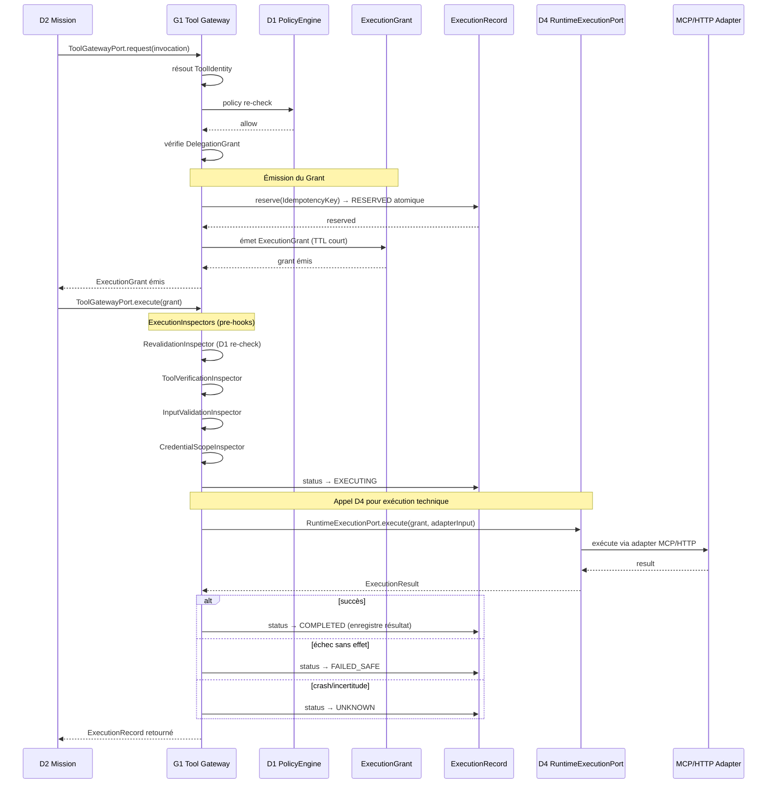
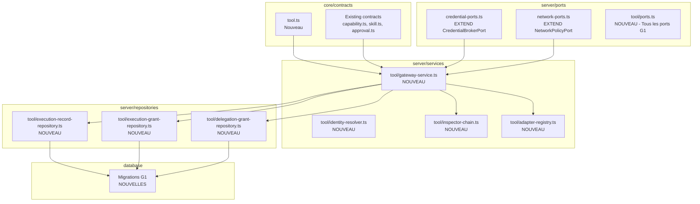

# G1 — Tool Gateway + ExecutionRecord Design

**Date:** 2026-07-26
**Author:** Governance Reconciliation Workstream
**Status:** READY_FOR_G1_IMPLEMENTATION
**Governance Reconciled:** PASS

---

## 1. Objectif

Créer le passage unique de tout effet externe (Tool Gateway), avec Policy/Approval,
revalidation, idempotence et audit juste avant la sortie — conformément au chemin
critique du [Master Plan](../architecture/future/03-critical-path.md) §7 et à la
[Governance Reconciliation](2026-07-26-governance-reconciliation-design.md).

**G1 ne remplace pas D4 et ne dépend pas de D4.**

Architecture canonique :
- D2 commande G1 pour les tool invocations
- G1 gouverne et décide (policy, approval, grant, inspectors)
- G1 appelle D4 `RuntimeExecutionPort` pour exécuter le travail autorisé
- G1 → D4 : autorisé
- D4 → G1 : **INTERDIT** (pas de cycle)

G1 intercepte les **effets externes** (écriture API, envoi email, mutation CRM,
appel MCP sortant) — juste avant la sortie vers le monde extérieur. Mais G1 ne se
limite pas aux effets externes : tout outil local/read-only peut également devoir
être gouverné par G1. Le critère n'est pas `hasExternalEffect` mais la
**classification de l'action** par la policy (D1).

---

## 2. Concepts — Classification ICOS-native

### 2.1 ToolGatewayPort — CREATE

**Point de passage unique pour tout effet externe.**

Le port expose quatre opérations, distinctes de l'`AgentRuntimeAdapter` D4 :

```
ToolGatewayPort.describe(toolId)     → ToolDescriptor (metadata, input/output schemas)
ToolGatewayPort.preview(invocation)  → HumanPreview (résumé lisible de l'effet attendu)
ToolGatewayPort.request(invocation)  → ExecutionGrant (après Policy + Approval)
ToolGatewayPort.execute(grant)       → ExecutionResult (après revalidation)
```

**EXISTS check :** Aucun équivalent dans le code actuel. D4 a `RuntimeExecutionPort`
qui exécute des steps de plan (locaux). G1 ajoute la **gouvernance** de toute invocation
d'outil, qu'il soit externe ou local.

**Position dans la stack (canonique) :**

```
D2 → résout qu'une étape de plan nécessite une invocation d'outil
↓
ToolGatewayPort.request(invocation) →
  D1 PolicyEngine revalide (SEC-D4-07) →
  Délégation vérifiée →
  ExecutionGrant émis →
↓
ToolGatewayPort.execute(grant) →
  ExecutionInspectors (pre-hooks) →
  ExecutionRecord créé (idempotencyKey) →
  RuntimeExecutionPort D4 (adapter local, MCP, HTTP) →
  Résultat enregistré dans ExecutionRecord →
  ExecutionRecord retourné
```

**INVARIANT :** D4 ne rappelle jamais G1.
G1 peut appeler D4 `RuntimeExecutionPort` pour l'exécution technique réelle,
mais D4 ne découvre pas G1 et n'a pas connaissance de son existence.

### 2.2 ToolIdentity — CREATE

**Identifiant unique et vérifiable d'un tool.**

Chaque tool est enregistré avec :
- `toolId` : identifiant unique (format `tool.<tenant>.<name>`)
- `capabilityKey` : la capability C1 qu'il implémente
- `adapterType` : type d'adaptateur (mcp, http, internal)
- `inputSchema` / `outputSchema` : Zod schemas de validation
- `requirements` : network, credential, isolation requirements (du Skill C2)
- `riskDefault` : niveau de risque par défaut

**EXISTS check :** Le `Skill` C2 a déjà `toolRequirements` (requiredTool, purpose, required).
G1 étend ce concept en `ToolIdentity` concrète, résolvable et vérifiable au runtime.

**EXISTS pattern :** Le `ToolDescriptor` est conceptuellement un croisement entre
la `Capability` C1 (ce qu'on peut faire) et le `toolRequirements` C2 (comment le faire).

### 2.3 ExecutionGrant — CREATE

**Ticket unique d'exécution fortement scoped, émis après Policy + Approval.**

Un grant pour l'invocation A ne doit JAMAIS pouvoir être utilisé pour l'invocation B.
Il est lié conceptuellement à l'ensemble minimal suivant :

```
ExecutionGrant {
  grantId: string                    // id unique du grant
  tenantId: string                   // tenant propriétaire
  principalId: string                // acteur/agent délégataire
  missionId: string                  // mission propriétaire
  runId: string                      // run dans lequel le grant est émis

  // Identité de l'outil
  toolId: string
  toolDefinitionHash: string         // hash de la définition du tool (anti-tool-smuggling)
  toolVersion: string                // version du tool au moment du grant

  // Invocation
  canonicalInputHash: string         // hash canonique des arguments
  operation: string                  // opération invoquée (ex: "email.send", "crm.create")

  // Décision politique
  policyProvenance: {
    policyVersion: string            // version de la politique D1 utilisée
    decision: "allow"
    attestedAt: string
    gatesPassed: string[]            // quelles gates ont été traversées
  }
  approvalResolutionRef: string | null // référence vers la résolution d'approval si level ≥ 3

  // Requirements (snapshot au moment du grant)
  credentialRequirements: string[]   // credentials nécessaires
  networkRequired: boolean           // réseau nécessaire
  isolationLevel: string             // niveau d'isolation exigé

  // Contraintes
  constraints: {
    maxRetries: number               // tentatives autorisées
    maxCostUsd?: number              // coût max estimé
    expiresAt: string                // TTL court (secondes, pas minutes)
  }

  issuedAt: string
}
```

**Vérifications immédiatement avant D4 execution :**
1. Grant freshness (TTL non expiré)
2. Canonical arguments hash (input non modifié)
3. Tool definition (version/hash inchangé)
4. Tenant / principal (scope toujours valide)
5. Revocation / expiration (grant non invalidé)

Tout mismatch → **DENY**. Aucun fallback tolérant.

**EXISTS check :** Aucun équivalent. D4 a `RuntimeState` (état interne de run) mais
pas de ticket d'exécution fortement scoped et vérifiable.

### 2.4 ExecutionRecord — CREATE

**Enregistrement immuable de chaque tentative d'exécution.**

```
ExecutionRecord {
  id: string
  idempotencyKey: string    // UNIQUE — clé d'idempotence
  grantId: string           // lien vers ExecutionGrant
  toolId: string
  input: unknown            // l'invocation complète
  canonicalInputHash: string // hash canonique de l'input (vérifié au retry)
  status: ExecutionRecordStatus
  // Status machine: RESERVED → EXECUTING → COMPLETED | FAILED_SAFE | UNKNOWN
  //                RESERVED → UNKNOWN (crash)
  //                EXECUTING → UNKNOWN (crash post-effet)
  //                FAILED_SAFE → RESERVED (retry)
  //                UNKNOWN → COMPLETED (reconciliation) | FAILED_SAFE (décision humaine)
  attempts: ExecutionAttempt[]
  output?: unknown          // résultat si succès
  error?: ExecutionError    // erreur si échec
  createdAt: string
  completedAt?: string
}
```

**ExecutionAttempt** (chaque tentative) — l'AttemptNumber NE fait PAS partie
de l'IdempotencyKey :

```
ExecutionAttempt {
  attemptNumber: number     // 1, 2, 3… orthogonal à l'IdempotencyKey
  startedAt: string
  completedAt?: string
  status: "executing" | "succeeded" | "failed"
  result?: unknown
  error?: ExecutionError
}
```

**EXISTS check :** D4 a `ExecutionResult` avec artefacts mais c'est un résultat VOLATILE
(pas persisté). `ExecutionRecord` est PERSISTÉ (table PostgreSQL) avec idempotencyKey.

### 2.5 IdempotencyKey — CREATE

**Clé unique garantissant qu'un effet externe n'est exécuté qu'une fois.**

L'IdempotencyKey est l'**identité stable de l'intention ou de l'effet**.
Elle ne varie pas entre les retries techniques. Le numéro de tentative
(`attemptNumber`) est un compteur orthogonal, jamais un composant de la clé.

**Construction :**

```
idempotencyKey = hash(tenantId + ":" + missionId + ":" + operation + ":" + canonicalInputHash + ":" + toolId)
```

Où `canonicalInputHash` est le hash SHA-256 de l'input après canonicalisation
JSON (clés triées, valeurs normalisées, espaces supprimés).

**Canonicalisation de l'input :**
- JSON.stringify avec clés triées alphabétiquement
- Valeurs `null` et `undefined` normalisées
- Tableaux dans l'ordre original
- Objets imbriqués récursivement canonicalsés

**Comportement :** (sémantique complète)

| Scénario | Comportement |
|----------|-------------|
| Première invocation, clé inconnue | → RESERVED atomique, puis EXECUTING |
| Même clé, même payload | → Retourne le résultat stocké (idempotent, pas de nouvelle exécution) |
| Même clé, payload DIFFÉRENT | → **REFUSÉ** (IDEMPOTENCY_CONFLICT, fail-closed) |
| Même clé, état UNKNOWN | → Ne rejoue PAS automatiquement (voir cycle de vie §2.5.1) |
| Même clé, état FAILED_SAFE | → Nouvelle tentative autorisée (retry) |

**Contrainte :** `UNIQUE(idempotencyKey)` en base. Couplée à une réservation
atomique (INSERT ... ON CONFLICT DO NOTHING / RETURNING).

**EXISTS check :** Aucun équivalent. Les actions D4 n'ont pas d'idempotence.

#### 2.5.1 Cycle de vie de l'Idempotency (ExecutionRecord states)

```
                  ┌──────────────┐
                  │   RESERVED   │ ← Réservation atomique, verrou optimiste
                  └──────┬───────┘
                         │
                    ┌────▼───────┐
                    │  EXECUTING │ ← Effectue l'appel externe
                    └────┬───────┘
                         │
              ┌────┬─────┴──────┬─────┐
              │    │            │     │
         ┌────▼──┐ │      ┌────▼──┐ │
         │COMPL. │ │      │FAILED │ │
         │       │ │      │_SAFE  │ │
         └───────┘ │      └───────┘ │
                   │                │
              ┌────▼───┐       ┌────▼───┐
              │UNKNOWN │       │UNKNOWN │
              │(crash) │       │(crash) │
              └────────┘       └────────┘
```

**États :**

| Status | Signification | Action sur retry |
|--------|---------------|------------------|
| `RESERVED` | Clé réservée mais exécution pas encore commencée | Attendre (concurrent) ou échouer après timeout |
| `EXECUTING` | Appel externe en cours | REFUSED (DUPLICATE) — ne jamais lancer deux fois |
| `COMPLETED` | Effet confirmé réussi | Rejouer le résultat stocké |
| `FAILED_SAFE` | Échec sans effet externe (timeout avant appel, échec local) | Nouvelle tentative autorisée |
| `UNKNOWN` | Crash après effet, pas de confirmation | NE PAS REJOUER. Tentative de reconciliation externe. Sinon REQUIRE_APPROVAL |

#### 2.5.2 Crash après effet externe (état UNKNOWN)

Le cas critique :

```
external effect succeeded (API acceptée, email envoyé)
↓
process/database crash
↓
completion record absent (état RESTANT UNKNOWN)
```

**Protocole :**

1. **NE PAS rejouer automatiquement.** Le retry automatique doublerait l'effet.
2. **Tenter une reconciliation** auprès de l'external authority si supportée
   (ex : requête GET /orders/{id} pour vérifier si la commande a été créée).
3. Si reconciliation possible et effet déjà appliqué → transition vers `COMPLETED`.
4. Si reconciliation impossible → état `UNKNOWN` maintenu.
5. En V1, sans EligibleApproverSnapshot + identité vérifiée :
   - **`MANUAL_INTERVENTION_REQUIRED`** — message d'incertitude, pas d'approbation machine
   - Le système reste en `UNKNOWN`, l'humain est notifié hors-band (email, notification)
   - Aucune décision machine ne tranche `UNKNOWN` sans preuve vérifiable
6. Après EligibleApproverSnapshot (P1) :
   - Un recovery `REQUIRE_APPROVAL` pourra être ajouté avec identité vérifiée
   - L'humain pourra décider : retenter (`FAILED_SAFE`) ou confirmer (`COMPLETED`)
7. **En aucun cas** une machine ne tranche `UNKNOWN → COMPLETED` sans
   preuve vérifiable.

#### 2.5.3 Concurrence et réservation atomique

```
BEGIN;
  INSERT INTO execution_records (idempotency_key, status) 
  VALUES ($key, 'RESERVED')
  ON CONFLICT (idempotency_key) DO NOTHING
  RETURNING *;
  -- Si RETURNING vide → clé déjà existante → lecture du résultat
  -- Si RETURNING non vide → réservé pour nous → on execute
COMMIT;
```

Deux workers concurrents avec la même idempotencyKey :
- Un seul gagne la réservation atomique
- L'autre reçoit `DUPLICATE_REQUEST` et attend (polling)
- Le gagnant exécute et passe en COMPLETED/FAILED_SAFE/UNKNOWN
- Le perdant peut alors récupérer le résultat

#### 2.5.4 Expiration et nettoyage

Les `RESERVED` sans progression depuis > 5 min sont considérés orphelins :
- Un worker de nettoyage les fait passer en `FAILED_SAFE`
- Un retry peut alors tenter une nouvelle réservation
- Les `COMPLETED` sont conservés selon la politique de rétention (au moins 90 jours)

### 2.6 ExecutionInspectors — CREATE

**Hooks d'inspection avant/après exécution.**

Calqués sur le pattern `PolicyGate` D1, mais exécutés juste avant l'effet externe :

```
ExecutionInspector {
  name: string
  preExecute(invocation, context): Promise<InspectionResult>
  postExecute(invocation, result, context): Promise<void>
}
```

**Inspectors requis pour G1 V1 :**
1. **RevalidationInspector** — re-vérifie D1 (pas de stale policy)
2. **ToolVerificationInspector** — vérifie que le tool appelé = le tool approuvé
3. **InputValidationInspector** — valide l'input contre le `inputSchema` du tool
4. **CredentialScopeInspector** — vérifie que les credentials résolus couvrent le tool

**EXISTS check :** Le pattern PolicyGate D1 est identique. G1 réutilise le concept
mais comme hooks spécifiques au moment critique (juste avant l'effet externe).

### 2.7 DelegationGrant — CREATE

**Délégation explicite d'une Mission vers un Agent avec scope et contraintes.**

```
DelegationGrant {
  id: string
  missionId: string
  agentId: string
  delegatedByUserId: string | null  // humain délégateur (ou null si auto)
  scope: {
    allowedTools: string[]
    maxDepth: number
    allowedTenants: string[]
    allowedCapabilities: string[]
  }
  constraints: {
    expiresAt: string
    maxConcurrentRuns: number
  }
  inheritedDeny: boolean   // true = fail-closed sur toute permission non listée
  grantedAt: string
}
```

**EXISTS check :** `AgentCapability` existe (capabilityId + agentId) mais sans scope,
expiration ou contraintes. `DelegationGrant` étend ce concept avec bornes explicites.

### 2.8 EligibleApproverSnapshot — CREATE

**Capture de qui est éligible pour approuver au moment de la soumission.**

```
EligibleApproverSnapshot {
  approverId: string
  roleAtTime: string
  permissionsAtTime: string[]
  capturedAt: string
}
```

Liste des approvers possibles, figée au moment où l'approval est demandée.
Empêche un acteur d'être ajouté *après* la soumission pour corrompre la décision.

**EXISTS check :** Le modèle `Approval` existant a `decidedBy` (étiquette déclarative
non authentifiée). `EligibleApproverSnapshot` ajoute la vérification côté identité.

### 2.9 D1 Level 4 — EXTEND

**Extension du RiskLevel de 3 vers 5 niveaux.**

| Niveau actuel | Nouveau niveau | Nom | Comportement |
|---|---|---|---|
| read_only | 0 | Observation | ApprovalStatus: not_required |
| — | 1 | Contributeur | Actions préparatoires, read-only étendu |
| reversible | 2 | Opérateur | Actions réversibles contrôlées |
| sensitive | 3 | Sensible | Approbation humaine obligatoire |
| — | 4 | Critique | Double approbation OU procédure renforcée OU interdit |

**EXISTS check :** `RiskGate` D1 gère read_only/reversible/sensitive. Level 4 étend
le même gate avec un nouveau cas pour les actions irréversibles à fort impact
(envoi de devis, approbation financière, mutation critique).

### 2.10 HumanPreview — CREATE

**Résumé lisible de l'effet attendu, présenté à l'humain avant approbation.**

```
HumanPreview {
  toolName: string
  summary: string         // "Envoi d'un devis de 1 500 € à client Dupont"
  inputParameters: Record<string, unknown>
  estimatedImpact: string // "Effet irréversible : le devis sera envoyé par email"
  riskLevel: number
  requiresApproval: boolean
  warningLevel: "none" | "info" | "warning" | "critical"
}
```

Produit par `ToolGatewayPort.preview()`. L'humain voit EXACTEMENT ce qui va être
exécuté avant d'approuver.

**EXISTS check :** Aucun équivalent.

---

## 3. Architecture détaillée

### 3.1 Flux complet d'une tool invocation



### 3.2 Contrats Zod (core)

**Emplacement :** `src/core/contracts/tool.ts` (nouveau fichier)

```typescript
// ─────────────────────────────────────
// Tool Identity
// ─────────────────────────────────────

export const toolIdSchema = z.string().min(3).regex(/^tool\.[a-z0-9_-]+\.[a-z0-9_-]+$/);

export const toolDescriptorSchema = z.object({
  toolId: toolIdSchema,
  name: z.string().min(1),
  description: z.string().optional(),
  capabilityKey: z.string().min(1),       // lien vers C1
  adapterType: z.enum(["mcp", "http", "internal"]),
  inputSchema: z.record(z.string(), z.unknown()).optional(),
  outputSchema: z.record(z.string(), z.unknown()).optional(),
  riskDefault: riskLevelSchema,           // niveau de risque par défaut
  networkRequired: z.boolean().default(false),
  credentialRequired: z.boolean().default(false),
  timeoutDefaultMs: z.number().int().positive().default(30_000),
});

// ─────────────────────────────────────
// Execution Grant
// ─────────────────────────────────────

export const policyProvenanceSchema = z.object({
  policyVersion: z.string().min(1),
  decision: z.literal("allow"),
  attestedAt: isoDateTimeSchema,
  gatesPassed: z.array(z.string()).default([]),
});

export const executionGrantSchema = z.object({
  grantId: idSchema,
  tenantId: z.string().min(1),
  principalId: z.string().min(1),
  missionId: z.string().min(1),
  runId: z.string().min(1),
  toolId: toolIdSchema,
  toolDefinitionHash: z.string().min(1),
  toolVersion: z.string().min(1),
  canonicalInputHash: z.string().min(1),
  operation: z.string().min(1),
  policyProvenance: policyProvenanceSchema,
  approvalResolutionRef: z.string().nullable(),
  credentialRequirements: z.array(z.string()).default([]),
  networkRequired: z.boolean().default(false),
  isolationLevel: z.enum(["none", "process", "container", "sandbox"]).default("none"),
  constraints: z.object({
    maxRetries: z.number().int().nonnegative().default(0),
    maxCostUsd: z.number().positive().optional(),
    expiresAt: isoDateTimeSchema,
  }),
  issuedAt: isoDateTimeSchema,
});

// ─────────────────────────────────────
// Execution Record & Attempts
// ─────────────────────────────────────

export const executionAttemptSchema = z.object({
  attemptNumber: z.number().int().positive(),
  startedAt: isoDateTimeSchema,
  completedAt: isoDateTimeSchema.optional(),
  status: z.enum(["executing", "succeeded", "failed"]),
  result: z.unknown().optional(),
  error: executionErrorSchema.optional(),
});

export const executionRecordStatusSchema = z.enum([
  "RESERVED", "EXECUTING", "COMPLETED", "FAILED_SAFE", "UNKNOWN",
]);

export const executionRecordSchema = z.object({
  id: idSchema,
  idempotencyKey: z.string().min(1),
  grantId: idSchema,
  toolId: toolIdSchema,
  input: z.unknown(),
  canonicalInputHash: z.string().min(1),
  status: executionRecordStatusSchema,
  attempts: z.array(executionAttemptSchema).default([]),
  output: z.unknown().optional(),
  error: executionErrorSchema.optional(),
  createdAt: isoDateTimeSchema,
  completedAt: isoDateTimeSchema.optional(),
  tenantId: z.string().min(1),
  missionId: z.string().min(1),
  runId: z.string().min(1),
});

// ─────────────────────────────────────
// Tool Invocation
// ─────────────────────────────────────

export const toolInvocationSchema = z.object({
  toolId: toolIdSchema,
  input: z.unknown(),
  correlationId: z.string().min(1),
  tenantId: z.string().min(1),
  missionId: z.string().min(1),
  runId: z.string().min(1),
  stepIndex: z.number().int().nonnegative(),
});

export const toolInvocationResultSchema = z.discriminatedUnion("ok", [
  z.object({
    ok: z.literal(true),
    output: z.unknown(),
    latencyMs: z.number().int().nonnegative(),
  }),
  z.object({
    ok: z.literal(false),
    error: executionErrorSchema,
    latencyMs: z.number().int().nonnegative(),
    artifacts: z.array(artifactItemSchema).default([]),
  }),
]);

// ─────────────────────────────────────
// Delegation Grant
// ─────────────────────────────────────

export const delegationGrantSchema = z.object({
  id: idSchema,
  missionId: idSchema,
  agentId: idSchema,
  delegatedByUserId: z.string().nullable(),
  scope: z.object({
    allowedTools: z.array(toolIdSchema),
    maxDepth: z.number().int().nonnegative().default(1),
    allowedTenants: z.array(z.string()),
    allowedCapabilities: z.array(z.string()),
  }),
  constraints: z.object({
    expiresAt: isoDateTimeSchema,
    maxConcurrentRuns: z.number().int().positive().default(1),
  }),
  inheritedDeny: z.boolean().default(true),
  grantedAt: isoDateTimeSchema,
});

// ─────────────────────────────────────
// Eligible Approver Snapshot
// ─────────────────────────────────────

export const eligibleApproverSnapshotSchema = z.object({
  approverId: z.string().min(1),
  roleAtTime: z.string().min(1),
  permissionsAtTime: z.array(z.string()),
  capturedAt: isoDateTimeSchema,
});

// ─────────────────────────────────────
// Human Preview
// ─────────────────────────────────────

export const humanPreviewSchema = z.object({
  toolName: z.string().min(1),
  summary: z.string().min(1),
  inputParameters: z.record(z.string(), z.unknown()),
  estimatedImpact: z.string().min(1),
  riskLevel: riskLevelSchema,
  requiresApproval: z.boolean(),
  warningLevel: z.enum(["none", "info", "warning", "critical"]),
});

// ─────────────────────────────────────
// Risk Level extension (D1 level 4)
// ─────────────────────────────────────

export const extendedRiskLevelSchema = z.union([
  z.literal(0),
  z.literal(1),
  z.literal(2),
  z.literal(3),
  z.literal(4),
]);
```

### 3.3 Ports (server)

**Emplacement :** `src/server/tool/ports.ts` (nouveau répertoire)

```typescript
// ─────────────────────────────────────
// Tool Gateway Port
// ─────────────────────────────────────

export interface ToolGatewayPort {
  describe(toolId: string): Promise<ToolDescriptor | null>;
  preview(invocation: ToolInvocation): Promise<HumanPreview>;
  request(invocation: ToolInvocation): Promise<ToolGatewayResult<ExecutionGrant>>;
  execute(grant: ExecutionGrant): Promise<ToolGatewayResult<ExecutionRecord>>;
}

// ─────────────────────────────────────
// Execution Record Repository
// ─────────────────────────────────────

export interface ExecutionRecordRepository {
  create(record: ExecutionRecord): Promise<ExecutionRecord>;
  findById(id: string): Promise<ExecutionRecord | null>;
  findByIdempotencyKey(key: string): Promise<ExecutionRecord | null>;
  updateStatus(id: string, status: ExecutionRecordStatus, error?: ExecutionError): Promise<void>;
  addAttempt(id: string, attempt: ExecutionAttempt): Promise<void>;
}

// ─────────────────────────────────────
// Execution Grant Repository
// ─────────────────────────────────────

export interface ExecutionGrantRepository {
  create(grant: ExecutionGrant): Promise<ExecutionGrant>;
  findById(id: string): Promise<ExecutionGrant | null>;
  invalidate(id: string): Promise<void>;
}

// ─────────────────────────────────────
// Delegation Grant Repository
// ─────────────────────────────────────

export interface DelegationGrantRepository {
  create(grant: DelegationGrant): Promise<DelegationGrant>;
  findActiveByMission(missionId: string): Promise<DelegationGrant | null>;
  findActiveByAgent(agentId: string): Promise<DelegationGrant[]>;
  invalidate(id: string): Promise<void>;
}

// ─────────────────────────────────────
// Execution Inspector
// ─────────────────────────────────────

export interface ExecutionInspector {
  readonly name: string;
  preExecute(invocation: ToolInvocation, context: InspectionContext): Promise<InspectionResult>;
  postExecute(invocation: ToolInvocation, result: ToolInvocationResult, context: InspectionContext): Promise<void>;
}

export interface InspectionContext {
  grant: ExecutionGrant;
  tenantId: string;
  missionId: string;
}

export type InspectionResult =
  | { outcome: "allow" }
  | { outcome: "deny"; reason: string; code: string };

// ─────────────────────────────────────
// Tool Adapter (MCP/HTTP/internal)
// ─────────────────────────────────────

export interface ToolAdapter {
  readonly type: "mcp" | "http" | "internal";
  execute(invocation: ToolInvocation): Promise<ToolInvocationResult>;
}
```

### 3.4 Architecture des fichiers



### 3.5 Tables PostgreSQL (migrations additives)

**Table `tools` :**
```sql
CREATE TABLE tools (
  id text PRIMARY KEY,
  name text NOT NULL,
  description text,
  capability_key text NOT NULL,
  adapter_type text NOT NULL CHECK (adapter_type IN ('mcp', 'http', 'internal')),
  input_schema jsonb,
  output_schema jsonb,
  risk_default text NOT NULL DEFAULT 'read_only',
  network_required boolean NOT NULL DEFAULT false,
  credential_required boolean NOT NULL DEFAULT false,
  timeout_default_ms integer NOT NULL DEFAULT 30000,
  created_at timestamptz NOT NULL DEFAULT now(),
  updated_at timestamptz NOT NULL DEFAULT now()
);
CREATE INDEX tools_capability_key_idx ON tools(capability_key);
```

**Table `execution_records` :**
```sql
CREATE TABLE execution_records (
  id text PRIMARY KEY,
  idempotency_key text NOT NULL UNIQUE,
  grant_id text NOT NULL,
  tool_id text NOT NULL REFERENCES tools(id),
  input jsonb NOT NULL,
  canonical_input_hash text NOT NULL,
  status text NOT NULL CHECK (status IN ('RESERVED','EXECUTING','COMPLETED','FAILED_SAFE','UNKNOWN')),
  attempts jsonb NOT NULL DEFAULT '[]',
  output jsonb,
  error jsonb,
  created_at timestamptz NOT NULL DEFAULT now(),
  completed_at timestamptz,
  tenant_id text NOT NULL,
  mission_id text NOT NULL,
  run_id text NOT NULL
);
CREATE INDEX execution_records_status_idx ON execution_records(status);
CREATE INDEX execution_records_mission_idx ON execution_records(mission_id);
CREATE INDEX execution_records_tenant_idx ON execution_records(tenant_id);
```

**Table `execution_grants` :**
```sql
CREATE TABLE execution_grants (
  id text PRIMARY KEY,
  tenant_id text NOT NULL,
  principal_id text NOT NULL,
  mission_id text NOT NULL,
  run_id text NOT NULL,
  tool_id text NOT NULL REFERENCES tools(id),
  tool_definition_hash text NOT NULL,
  tool_version text NOT NULL,
  canonical_input_hash text NOT NULL,
  operation text NOT NULL,
  policy_provenance jsonb NOT NULL,
  approval_resolution_ref text,
  credential_requirements jsonb NOT NULL DEFAULT '[]',
  network_required boolean NOT NULL DEFAULT false,
  isolation_level text NOT NULL DEFAULT 'none',
  constraints jsonb NOT NULL,
  issued_at timestamptz NOT NULL DEFAULT now()
);
CREATE INDEX execution_grants_tool_idx ON execution_grants(tool_id);
CREATE INDEX execution_grants_mission_idx ON execution_grants(mission_id);
CREATE UNIQUE INDEX execution_grants_input_hash_unique ON execution_grants(tool_id, canonical_input_hash);
```

**Table `delegation_grants` :**
```sql
CREATE TABLE delegation_grants (
  id text PRIMARY KEY,
  mission_id text NOT NULL,
  agent_id text NOT NULL,
  delegated_by_user_id text,
  scope jsonb NOT NULL,
  constraints jsonb NOT NULL,
  inherited_deny boolean NOT NULL DEFAULT true,
  granted_at timestamptz NOT NULL DEFAULT now(),
  invalidated_at timestamptz
);
CREATE INDEX delegation_grants_mission_idx ON delegation_grants(mission_id);
CREATE INDEX delegation_grants_agent_idx ON delegation_grants(agent_id);
```

---

## 4. Intégration avec l'existant

### 4.1 Intégration D4 (RuntimeExecutionPort)

G1 appelle D4 `RuntimeExecutionPort` pour l'exécution technique, jamais l'inverse.

L'`ExecutionOrchestrator` D4 ne découvre pas G1, n'a pas connaissance de son
existence et n'est pas modifié. La frontière est unidirectionnelle :

```
G1 ToolGatewayService
  → RuntimeExecutionPort.execute(input)  // autorisé
```

**Ce que G1 utilise de D4 :**
- `RuntimeExecutionPort.execute()` — signature à vérifier après merge D4.1
- `ExecuteStepInput` — G1 construit un input compatible à partir du grant + invocation
- `ExecutionResult` — G1 consomme le résultat et l'enregistre dans ExecutionRecord

**Ce que G1 ne fait PAS :**
- Il ne modifie pas D4
- Il ne dépend pas de D4 pour sa logique de gouvernance
- Il ne crée pas de dépendance circulaire

**Adapter pattern :** G1 peut optionnellement wrapper un `AgentRuntimeAdapter`
dans un `ToolAdapter` pour réutiliser l'isolation workspace de D4, mais
c'est G1 qui résout et appelle l'adapter, pas D4 qui le découvre.

### 4.2 Intégration D1 (PolicyEngine)

G1 réutilise le `D1PolicyEngine` existant comme re-validation pré-exécution.

Le `RevalidationInspector` appelle `D1PolicyPort.decide()` avec le même `PolicyRequest`
que SEC-D4-07 mais juste avant l'effet externe (pas avant le début du run D4).

### 4.3 Intégration D2 (Mission)

`DelegationGrant` est lié à une `Mission` D2. La création se fait :
- Au démarrage de la Mission (si mode "délégué")
- Ou au moment du premier effet externe

`ExecutionRecord` référence `missionId` et `runId` pour la corrélation.

### 4.4 Intégration C2 (Skill Registry)

Le `toolRequirements` du Skill C2 alimente le `ToolIdentity` :
- requiredTool → toolId
- required → vérifié au moment de la résolution
- purpose → description dans ToolDescriptor

### 4.5 Intégration Container

Le container (memory + PostgreSQL) doit être étendu avec les nouveaux repositories :

```typescript
interface Container {
  // ...existing fields...
  
  // G1 — Tool Gateway
  toolGateway?: ToolGatewayPort;
  toolIdentityResolver?: ToolIdentityResolver;
  executionRecords?: ExecutionRecordRepository;
  executionGrants?: ExecutionGrantRepository;
  delegationGrants?: DelegationGrantRepository;
  toolAdapters?: Map<string, ToolAdapter>;
  executionInspectors?: ExecutionInspector[];
}
```

---

## 5. Tool Gateway API — Décision architecturale

### 5.1 Analyse des deux options

| Aspect | **A) `invoke()` monolithique** | **B) `request()` + `execute()` biphasique** |
|--------|-------------------------------|---------------------------------------------|
| **Interface** | `invoke(invocation) → ExecutionRecord` | `request(invocation) → ExecutionGrant` + `execute(grant) → ExecutionRecord` |
| **Separation of concerns** | Faible : policy + approval + execution dans le même appel | Forte : policy/approval distinct de l'exécution |
| **Human-in-the-loop** | Impossible sans état persistant externe : l'approval doit être synchrone | Naturel : request() produit un grant, l'humain approuve, execute() consomme le grant |
| **Retry** | Pas de jeton réutilisable : chaque retry repasse par la policy | Le grant prouve que la policy a déjà été traversée. Les retries dans FAILED_SAFE réutilisent le grant |
| **TOCTOU** | Un seul point de contrôle : le moment de `invoke()` | Deux points : request() + execute(). Risque de stale grant entre les deux |
| **Granularité d'audit** | Un enregistrement = tout | request() et execute() sont des événements séparés dans l'audit |

### 5.2 Décision pour G1 V1 : **B) request() + execute() biphasique**

Justification :
1. **Human-in-the-loop obligatoire** — G1 doit supporter l'approbation humaine.
   L'option A forcerait à bloquer l'appelant pendant une durée non bornée.
2. **Séparation claire policy/exécution** — le grant est une preuve vérifiable
   que la policy a été traversée.
3. **Le risque TOCTOU est maîtrisé :**
   - TTL court sur le grant (secondes, pas minutes)
   - `RevalidationInspector` re-vérifie D1 avant execute()
   - Les `ExecutionInspectors` (pre-hooks) sont exécutés dans execute(), pas request()

### 5.3 Garanties contre les risques du biphasique

| Risque | Mitigation |
|--------|------------|
| **Stale grant** | TTL court (secondes). Vérifié par `RevalidationInspector` avant execute(). |
| **Approval replay** | L'`approvalResolutionRef` est lié au grant. L'approval est à usage unique : une fois consommée, elle ne peut plus produire de nouveau grant. |
| **TOCTOU** | `RevalidationInspector` re-vérifie D1 dans execute(). Les `ExecutionInspectors` sont la dernière ligne de défense avant l'appel D4. |
| **Duplicate execution** | `IdempotencyKey` avec réservation atomique en base. Le même grant ne peut pas produire deux `ExecutionRecord` avec le même `idempotencyKey.` |

### 5.4 API finale

```typescript
interface ToolGatewayPort {
  /** Décrit les métadonnées d'un tool (lecture seule). */
  describe(toolId: string): Promise<ToolDescriptor | null>;

  /** Produit un résumé lisible de l'effet attendu (lecture seule). */
  preview(invocation: ToolInvocation): Promise<HumanPreview>;

  /** Soumet une demande d'exécution, reçoit un grant si autorisé. */
  request(invocation: ToolInvocation): Promise<ToolGatewayResult<ExecutionGrant>>;

  /** Exécute le grant : inspectors → idempotency → D4 → record. */
  execute(grantRef: ExecutionGrantRef): Promise<ToolGatewayResult<ExecutionRecord>>;
}
```

Où `ExecutionGrantRef` est une référence légère au grant (id + canonicalInputHash),
sans reproduire tout le contenu :

```typescript
export const executionGrantRefSchema = z.object({
  grantId: idSchema,
  canonicalInputHash: z.string().min(1),
});
```

---

## 6. Relations avec les invariants de sécurité existants

### 6.1 SEC-D4-01 (Credential Isolation) → G1

G1 ne modifie pas `CredentialBrokerPort`. Les credentials restent des références.
Le `CredentialScopeInspector` vérifie que les credentials résolus couvrent le tool
appelé.

### 6.2 SEC-D4-02 (Network Default Deny) → G1

G1 réutilise `NetworkPolicyPort`. Tout tool qui nécessite le réseau (`networkRequired`)
déclenche une vérification réseau avant exécution.

### 6.3 SEC-D4-07 (D1 Re-check) → G1

G1 ajoute une **seconde** re-validation au moment de l'effet externe (en plus de celle
déjà faite au début du run D4). C'est le dernier point de contrôle avant la sortie.

### 6.4 SEC-D4-08 (TOCTOU) → G1

L'`ExecutionGrant` a un TTL court (secondes, pas minutes). Entre l'émission du grant
et l'exécution, les `ExecutionInspectors` revalident tous les invariants.

### 6.5 SEC-D4-10 (Credential Scrubbing) → G1

Les `ExecutionRecord` ne contiennent jamais de credentials bruts. Le logging reprend
le même pattern de sanitization que D4.

---

## 7. Lots d'implémentation G1

### Lot G1.0 — Fondation et Idempotence (P0, CRITICAL PATH)

**Chemin critique du premier Tool Gateway V1.**

**Contenu :**
- Contrats Zod (`core/contracts/tool.ts`)
- `IdempotencyKey` : construction + canonicalisation + réservation atomique
- `ExecutionRecord` : contrat + repository + cycle de vie (RESERVED→EXECUTING→COMPLETED|FAILED_SAFE|UNKNOWN)
- `ExecutionGrant` : contrat + repository + binding fort
- Table `execution_records` + migration
- Table `execution_grants` + migration
- Tests : UNIQUE(idempotencyKey), collision atomique, rejeu idempotent, crash→UNKNOWN, payload mismatch→IDEMPOTENCY_CONFLICT

**Dépendances :** D2 (Mission/Run IDs), D4 (RuntimeExecutionPort signature) — MERGED (vérification après merge D4.1)

### Lot G1.1 — Tool Gateway (P0, CRITICAL PATH)

**Chemin critique du premier Tool Gateway V1 (parallélisable après G1.0).**

**Contenu :**
- `ToolGatewayPort` : describe, preview, request, execute
- `ToolIdentity` : résolution + vérification
- `ToolGatewayService` : implémentation principale
- `ExecutionInspector` chaine (Revalidation, ToolVerification, InputValidation, CredentialScope)
- `ToolAdapter` pattern (MCP, HTTP)
- Table `tools` + migration
- Tests : tout outil gouverné par le Gateway, tool inconnu refusé, input invalide refusé

**Dépendances :** G1.0, C2 (ToolRequirements), D4 (CredentialBrokerPort, NetworkPolicyPort, RuntimeExecutionPort)

### Lot G1.2 — Délégation & Approbation (P1, NE BLOQUE PAS G1 V1)

**Ne bloque pas le cœur ALLOW/DENY de G1 V1, mais BLOQUE le chemin REQUIRE_APPROVAL.**

Le modèle `approval.decidedBy` existant est une étiquette déclarative NON
authentifiée. Aucun `ExecutionGrant` pour une action sensible ne peut être
émis sur la seule base de `decidedBy`.

Donc pour G1 V1 :

| Chemin D1 | Statut G1 V1 | Raison |
|-----------|-------------|--------|
| ALLOW | OPÉRATIONNEL | Délégation implicite (Agent a la Capability) |
| DENY | OPÉRATIONNEL | Fail-closed, ne nécessite pas d'approbation |
| REQUIRE_APPROVAL | **NON OPÉRATIONNEL** | `decidedBy` non authentifié, impossible d'émettre un grant fiable |

`EligibleApproverSnapshot` + identité vérifiée sont **P1 immédiat** pour
débloquer le chemin REQUIRE_APPROVAL.

Pour G1 V1, la délégation peut être implicite (l'Agent qui possède la
`Capability` est autorisé). Le `DelegationGrant` explicite et
l'`EligibleApproverSnapshot` sont des renforcements de sécurité qui
peuvent suivre immédiatement.

**Contenu :**
- `DelegationGrant` : contrat + repository + service
- `DelegationConstraint` : scope, expiration, depth
- `EligibleApproverSnapshot` : capture au moment de l'approval
- Extension `Approval` existant avec snapshot
- D1 level 4 : extension `riskLevelSchema` + `RiskGate`
- Table `delegation_grants` + migration
- Tests : délégation bornée, timing attack prévenu, level 4 bloqué sans procédure

**Dépendances :** D1 (PolicyEngine), Identity (Role/Permissions) — MERGED

### Lot G1.3 — Human Preview & Approval UX (P1, NE BLOQUE PAS G1 V1)

**Se connecte au Cockpit existant. Le frontend n'est jamais l'autorité d'approbation.**

**Contenu :**
- `HumanPreview` : génération depuis ToolGatewayPort.preview()
- Résumé lisible de l'effet attendu
- UX approval avec scope visible
- Tests : preview exacte, confirmation scope

**Dépendances :** G1.1, G1.2

---

## 8. Tests

### 8.1 Tests unitaires

| Test | Lot | Description |
|------|-----|-------------|
| UNIQUE idempotencyKey empêche double soumission | G1.0 | Même clé, deuxième appel refuse |
| Rejeu idempotent retourne résultat stocké | G1.0 | Même clé, retourne le même résultat |
| IdempotencyKey différente, payload différent accepté | G1.0 | Clé unique → nouvelle exécution |
| ExecutionGrant TTL expiré refuse exécution | G1.0 | Grant après expiration → FAILED |
| Tool inconnu refusé par Gateway | G1.1 | describe() retourne null → request refuse |
| Input invalide refusé par InputValidationInspector | G1.1 | Input hors schema → preExecute deny |
| DelegationGrant scope vérifié | G1.2 | Tool hors scope → refusé |
| EligibleApproverSnapshot figé à la soumission | G1.2 | Approver ajouté après soumission → non capturé |
| D1 level 4 refuse sans double approbation | G1.2 | Level 4 sans procédure → DENY |
| HumanPreview correspond à l'invocation | G1.3 | preview() produit un résumé fidèle |

### 8.2 Tests d'intégration

| Test | Description |
|------|-------------|
| G1 + D4 : invocation outil exécutée via RuntimeExecutionPort | G1 construit ExecuteStepInput depuis le grant |
| D1 re-validation : policy change entre request et execute | Policy change → execute refuse |
| Credential scope : tool requiert credential absent | CredentialScopeInspector refuse |
| Réservation atomique : deux workers concurrents | Un seul obtient RESERVED |
| UNKNOWN : résultat récupéré après crash du worker | Vérification que l'état est `UNKNOWN` et non perdu |
| Container memory : G1 repositories | Création + lecture ExecutionRecord |

### 8.3 Tests de sécurité

| Test | Référence | Description |
|------|-----------|-------------|
| Double exécution externe empêchée | SEC-G1-01 | Retry ne double pas l'effet |
| Grant stale refusé | SEC-G1-02 | TTL dépassé → exécution refusée |
| Tool non authorisé refusé | SEC-G1-03 | Tool hors scope DelegationGrant → DENY |
| Timing attack prévenu | SEC-G1-04 | Approver ajouté après soumission → non valide |
| Credential jamais dans ExecutionRecord | SEC-G1-05 | Pattern matching sur les logs |
| Fail-closed sur toute erreur G1 | SEC-G1-06 | Erreur interne → DENY |

---

## 9. Revalidation D4.1 — MERGED_AND_VERIFIED

### SHA de vérification

```
main SHA: 618ff19ed367e9c82a54f66c147629f73f0fc7e0
D4.1: MERGED_AND_VERIFIED
```

### Résultats de la revalidation

| Port/Contrat | Statut | Notes |
|---|---|---|
| `RuntimeExecutionPort.execute()` | **PASS** | Signature inchangée : `(input: ExecuteStepInput, signal?: AbortSignal) => Promise<ExecutionResult>` |
| `ExecuteStepInput` | **PASS** | Inchangé. G1 peut construire un input compatible depuis le grant + invocation. |
| `RuntimeAdapterInput` | **PASS** | Extension additive : `command`, `args`, `env` ajoutés (optionnels). Comportement V1 sans command conservé. G1 peut utiliser `command`+`args` pour les tools. |
| `ExecutionResult` | **PASS** | Inchangé. G1 peut consommer le résultat. |
| `D1PolicyPort.decide()` | **PASS** | Inchangé. Utilisé par RevalidationInspector. |
| `CredentialBrokerPort.resolve()` | **PASS** | Inchangé. |
| `NetworkPolicyPort.check()` | **PASS** | Inchangé. |

### Invariants vérifiés

- **Aucune dépendance D4 → G1** : D4 ne référence pas G1, n'importe aucun symbole G1.
- **Aucune modification D4 nécessaire** : G1 peut appeler `RuntimeExecutionPort.execute()`
  avec un `ExecuteStepInput` construit à partir du grant.
- **D4.1 a ajouté `command`/`args`/`env` optionnels** dans `RuntimeAdapterInput`.
  G1 pourra les utiliser pour passer le tool à exécuter, mais ce n'est pas
  obligatoire pour V1 (G1 peut wrapper l'appel via l'adapter local par défaut).
- **G1 importe les types D4, D4 n'importe pas G1** — frontière unidirectionnelle respectée.

### Nouveaux champs D4.1 exploitables par G1

```
RuntimeAdapterInput.command  → chemin de l'exécutable du tool (optionnel)
RuntimeAdapterInput.args     → arguments séparés, jamais shell (optionnel)
RuntimeAdapterInput.env      → variables d'environnement (optionnel)
```

G1 peut construire un `RuntimeAdapterInput` depuis le `ExecutionGrant` + `ToolDescriptor`
sans aucune modification de D4.

---

## 10. POST-D4.1 FINAL REPORT

```
main SHA:
  618ff19ed367e9c82a54f66c147629f73f0fc7e0

RuntimeExecutionPort compatibility:
  PASS ✓ — Signature inchangée. G1 peut appeler D4 sans modifier D4.

ExecuteStepInput compatibility:
  PASS ✓ — Inchangé. G1 construit un input compatible depuis le grant.

RuntimeAdapterInput compatibility:
  PASS ✓ — Extension additive (command, args, env optionnels).
  G1 peut utiliser les nouveaux champs pour les tools.

ExecutionResult compatibility:
  PASS ✓ — Inchangé. G1 consomme le résultat et l'enregistre.

G1→D4 boundary:
  PASS ✓ — G1 → D4 seulement (RuntimeExecutionPort). D4 → G1 interdit.
  D4 ne découvre pas G1, n'est pas modifié par G1.

D4→G1 dependency:
  NONE — D4 ne référence aucun symbole G1. Frontière unidirectionnelle vérifiée.

Circular dependency:
  NONE — Architecture unidirectionnelle vérifiée : D2 → G1 → D1/inspectors → D4

ALLOW path:
  OPERATIONAL ✓ — Délégation implicite (Agent a la Capability). Grant émis.

DENY path:
  OPERATIONAL ✓ — Fail-closed. Pas d'approbation nécessaire.

REQUIRE_APPROVAL path:
  NOT_OPERATIONAL — decidedBy est NON authentifié.
  Aucun grant sensible ne peut être émis sur la seule base de decidedBy.
  EligibleApproverSnapshot + identité vérifiée sont P1 immédiat pour débloquer.

UNKNOWN recovery:
  PASS ✓ — UNKNOWN : ne pas rejouer automatiquement.
  → Tentative de reconciliation externe.
  → Si impossible : MANUAL_INTERVENTION_REQUIRED (fail-closed, V1).
  → Après EligibleApproverSnapshot (P1) : REQUIRE_APPROVAL possible.
  → Jamais de transition automatique UNKNOWN vers COMPLETED.

EligibleApproverSnapshot:
  P1 — Ne bloque pas le cœur ALLOW/DENY de G1 V1.
  BLOQUE le chemin REQUIRE_APPROVAL (non opérationnel sans lui).

Spec changes after D4.1:
  NONE — Tous les ports D4 sont compatibles. Aucune modification de spec nécessaire.
  Les nouveaux champs D4.1 (command, args, env) sont optionnels et exploitables par G1.

Implementation blockers for G1.0 + G1.1:
  NONE — Toutes les dépendances sont MERGED et vérifiées sur main.

STATUS:
  READY_FOR_G1_IMPLEMENTATION
```
