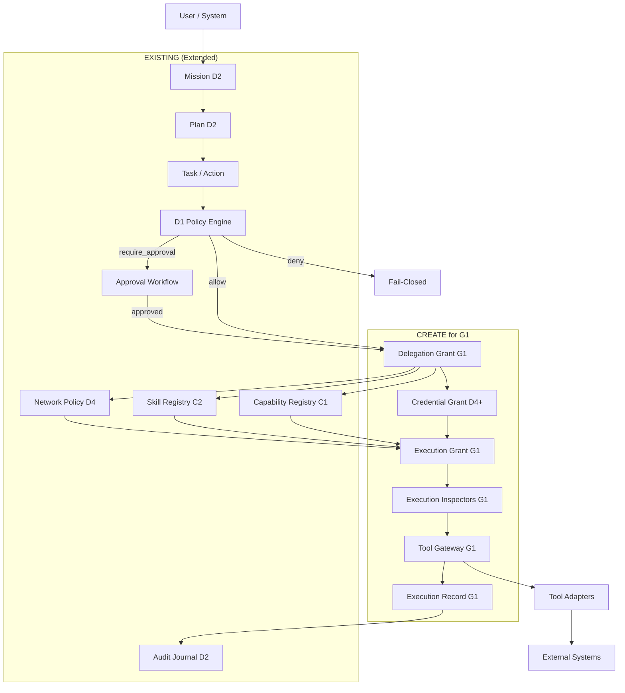
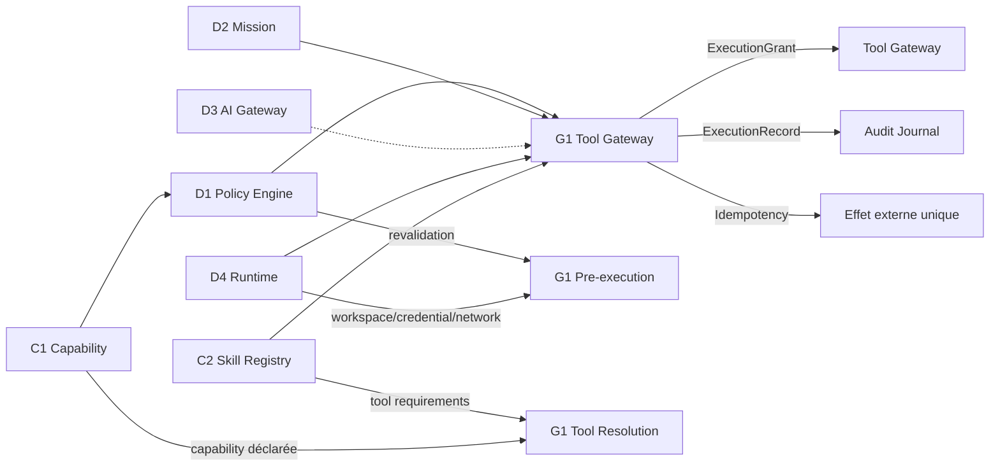

# ICOS — Governance Reconciliation Design

**Date:** 2026-07-26
**Author:** Governance Reconciliation Workstream (parallel to D4.1)
**Status:** DESIGN_READY_WAITING_FOR_D4_1
**Target branch:** `feat/governance-reconciliation`

---

## 1. État réel ICOS — Audit complet du dépôt

### 1.1 D1 — Policy / Authorization (MERGED)

**Fichiers clés :**
- `src/core/policy/engine.ts` — `D1PolicyEngine` (chaîne de gates PUR)
- `src/core/policy/contract.ts` — `PolicyRequest`, `PolicyDecision`, `PolicyActor`, `PolicyResource`, `PolicyEnvironment`
- `src/core/policy/gates/` — 7 gates :
  - `TenantGate` — isolation tenant
  - `IDORGate` — cross-tenant IDOR prevention
  - `ClassificationGate` — C0–C3 sensitivity level check
  - `RetentionGate` — C3 retention policy requirement
  - `PermissionGate` — `resource.type.action` permission check
  - `RiskGate` — authorizationLevel vs risk level
  - `ExternalEffectGate` — external mutation requires approval
- `src/core/authorization/decide.ts` — `decideExecution()` (legacy, toujours utilisé)
- `src/server/policy/d1-policy-service.ts` — `D1PolicyService` wrapper
- `src/core/identity/permissions.ts` — matrice hiérarchique viewer→operator→admin→owner

**État :** Solide. Gates modulaires, fail-closed, DENY supérieur. 3 niveaux de risque (read_only/reversible/sensitive). 4 niveaux d'autorisation (0–3).

**Gaps G1 :** Pas de revalidation au moment de l'effet externe (seulement au runtime D4). Pas de preview conditionnelle. Pas de niveau 4 (critique/double approbation). Le `PermissionGate` construit la permission comme `resource.type.action` — simple mais efficace.

### 1.2 D2 — Durable Orchestration / Mission Engine (MERGED)

**Fichiers clés :**
- `src/core/mission/contract.ts` — Mission, Plan, Step, Run
- `src/core/mission/lifecycle.ts` — Machine d'état Mission (14 états)
- `src/server/mission/mission-service.ts` — `MissionService`
- États suspendus : WAITING_FOR_APPROVAL, BLOCKED_BY_POLICY, PROVIDER_UNAVAILABLE, TOOL_FAILED, STALE_ATTESTATION, MISSION_RECOVERABLE, SKILL_REVOKED
- États terminaux : COMPLETED, FAILED, CANCELLED

**Gaps G1 :** Pas de lien direct Mission → ExecutionRecord. La reprise après crash est implicite (pas de checkpoint transactionnel explicite). Pas de heartbeat.

### 1.3 D3 — AI Gateway / OmniRoute (MERGED)

**Fichiers clés :**
- `src/core/ai/contract.ts` — `AiRoutingRequest`, `AiGenerationResult`, `AiErrorCode`
- `src/server/ai/ports.ts` — `AiGatewayPort.generate()`, `AiHealthPort.check()`
- `src/server/ai/omniroute-adapter.ts` — `OmniRouteAdapter` (traduction ICOS→OmniRoute)
- `src/server/ai/omniroute-config.ts` — Configuration

**État :** Complet avec intents métier (BEST_REASONING, BEST_CODING, FAST, CHEAP, PRIVATE), budget, qualité, fallback. Intégré dans D4 (ExcecutionOrchestrator appelle AiGatewayPort pour les steps AI).

### 1.4 D4 — Runtime Foundation (MERGED)

**Fichiers clés :**
- `src/core/runtime/contract.ts` — ExecutionResult, ExecuteStepInput, RuntimeState, Artifact, UsageMetadata
- `src/core/runtime/lifecycle.ts` — Machine d'état execution (STARTING→RUNNING→SUCCEEDED|FAILED|CANCELLED|TIMED_OUT|LOST)
- `src/server/runtime/execution-orchestrator.ts` — `ExecutionOrchestrator` (orchestrateur complet)
- `src/server/runtime/ports.ts` — `RuntimeExecutionPort`, `CredentialBrokerPort`, `NetworkPolicyPort`
- `src/server/runtime/workspace-manager.ts` — `WorkspaceManager` (isolation workspace)
- `src/server/runtime/artifact-collector.ts` — `ArtifactCollector`
- `src/server/runtime/security-gates.test.ts` — SEC-D4-01 à SEC-D4-10 + D4-17

**Sécurité présente :**
- SEC-D4-01: Credential isolation (références, pas de valeurs brutes)
- SEC-D4-02: Network default deny
- SEC-D4-03: Workspace path traversal (../ detecté et refusé)
- SEC-D4-04: Symlink escape detection
- SEC-D4-07: D1 re-check à chaque execution (TOCTOU runtime)
- SEC-D4-08: TOCTOU-sensitive hash mismatch
- SEC-D4-09: Cleanup safety (hors root refusé)
- SEC-D4-10: Log/artifact credential scrubbing
- D4-17: Process tree cleanup

### 1.5 C1 — Capability Registry (MERGED)

**Fichiers clés :**
- `src/core/contracts/capability.ts` — Capability (proposed→active→deprecated→retired), AgentCapability
- `src/core/capabilities/lifecycle.ts` — `resolveActiveCapability()`
- `src/server/services/capability-service.ts` — Capability service
- Compliance fields : sensitivityLevel, dataCategory, retentionPolicyRef
- Capability a `provenance` (record) et `riskHint` (string)

### 1.6 C2 — Skill Registry & Trust Lifecycle (MERGED)

**Fichiers clés :**
- `src/core/contracts/skill.ts` — Skill, TrustState, ActivationState, SecurityScan, Evaluation, SecurityFinding
- `src/core/skills/lifecycle.ts` — isTrustTransitionAllowed, isActivationTransitionAllowed, isStateValid, isAttestationValid
- `src/core/skills/hash.ts` — Content hash computation
- `src/server/services/skill-service.ts` — Skill service

**Particularités :**
- TrustState: untrusted → quarantined → reviewed → approved → rejected (terminal)
- ActivationState: inactive → active → suspended → revoked (terminal)
- Cross-invariants: activationState=active ⇒ trustState=approved ; trustState=rejected ⇒ activationState=revoked
- Content immutability in approved/rejected states
- SecurityFindings with category (prompt_injection, exfiltration, privilege_escalation, etc.)
- Provenance (source, origin, contentHash, originalManifest)
- Requirements déclaratifs : network, credential, execution isolation, tools, dependencies
- Stale attestation check (contentHash comparison)

**Mapping Nvidia Skills :** C2 couvre déjà : skill trust, scan (securityFindings), eval, supply chain (provenance, dependencyDeclarations). Signature pas encore explicite mais le contentHash permet l'attestation.

### 1.7 Identity & Auth (MERGED)

- Roles : viewer, operator, admin, owner (hiérarchie strict)
- Permissions : cockpit.read, tasks.write, approvals.decide, audit.read.*, agents.manage, config.manage, capabilities.*, skills.*
- Auth : Better-Auth (Next.js), session-based, HTTP guards (requireSession, requireRole, requirePermission)
- Security events : auth.login.succeeded/rejected, auth.logout.succeeded, auth.access.denied
- Human-Agent Link : association validation
- Tenant isolation : tenant context resolvé

### 1.8 Approvals (EXISTANT BASELINE)

- `src/core/contracts/approval.ts` — Simple model : actionId, decidedBy (label), decision (approved|rejected), reason
- `src/core/contracts/common.ts` — approvalStatus (not_required|pending|approved|rejected)
- `src/core/authorization/decide.ts` — Decision engine utilisant approvalStatus

**Gaps G1 :** Pas de multi-approver, pas de EligibleApproverSnapshot, pas de policyVersion couplée à la décision, pas de quorum. Le `decidedBy` est une étiquette déclarative non authentifiée.

### 1.9 Task (EXISTANT BASELINE)

- `src/core/contracts/task.ts` — Task (draft→queued→awaiting_approval→running→succeeded|failed|cancelled)
- `src/core/tasks/lifecycle.ts` — canTransition(), transitionTask()
- Lien avec actions via actionIds[]

---

## 2. Matrice EXISTS / EXTEND / RECONCILE / CREATE / DEFER / DISCARD

### Policy / Approval

| Concept | Classification | Justification |
|---------|---------------|---------------|
| `ExecutionPolicyRule` | **RENAME_RECONCILE** → `PolicyGate` existant dans D1PolicyEngine. Renommer le concept externe ; le pattern ICOS-native est "gate chain". |
| `PolicyProvenance` | **EXTEND** — Pas de provenance formelle sur les règles de policy. Ajouter `policyProvenance` aux PolicyVersion futures. |
| `ApprovalPolicy` | **EXTEND** — Le RiskGate et ExternalEffectGate déclenchent `require_approval`. Manque : policy versionnée, preview conditionnelle, niveau 4. |
| `ApprovalRequest` | **EXISTS** — Modèle `approval` dans les contrats. |
| `ApprovalVote` | **DEFER** — Pas de multi-approver avant G1. Simple approve/reject suffit. |
| `ApprovalResolution` | **DEFER** — Résultat de quorum ; pas avant multi-approver. |
| `EligibleApproverSnapshot` | **CREATE** pour G1 — Au moment de l'approbation, capturer qui était éligible (anti-timing-attack). |
| `ExecutionGrant` | **CREATE** pour G1 — Ticket d'exécution unique après Policy + Approval, avec expiration. |

### Delegation / Runtime

| Concept | Classification | Justification |
|---------|---------------|---------------|
| `DelegationGrant` | **CREATE** pour G1 — Délégation explicite d'une Mission vers un Agent avec scope et contraintes. |
| `DelegationConstraint` | **CREATE** avec DelegationGrant — Durée, profondeur, resources, permissions max. |
| `InheritedDeny` | **EXTEND** — D1PolicyEngine fail-closed = DENY supérieur implicite. Rendre le concept explicite dans la chaîne de délégation. |
| `DelegatedCapability` | **EXTEND** — L'AgentCapability existe (capabilityId + agentId). Rendre la délégation explicite avec scope et expiration. |
| `AgentRun` | **RENAME_RECONCILE** → `Run` D2 (dans Mission). Le concept D2 `Run` est plus riche : stepIndex, status, result, output. |
| `DelegationMode` | **CREATE** pour G1 — Mode de délégation (sync/async/deep) contrôlé par la policy. |

### Execution / G1

| Concept | Classification | Justification |
|---------|---------------|---------------|
| `ToolIdentity` | **CREATE** pour G1 — Identifiant unique et vérifiable d'un tool dans le Gateway. |
| `ExecutionInspector` | **EXTEND** — Pattern Goose/ICOS : les PolicyGates D1 sont déjà des inspecteurs. Étendre avec des pre-execution hooks pour G1. |
| `ExecutionIsolationProfile` | **EXTEND** — Le Skill a déjà `executionIsolationRequirement`. Rendre composable en profile réutilisable (none/process/container/sandbox). |
| `NetworkPolicy` | **EXTEND** — NetworkPolicyPort existe (DENY par défaut). Étendre avec scope par skill + tenant. |
| `CredentialGrant` | **EXTEND** — CredentialBrokerPort existe (références seulement). Étendre avec scope + expiration + audit trail. |
| `ExternalAuthority` | **CREATE** pour G1 — Autorité externe (API tierce, webhook, signature) validée avant exécution. |
| `ExecutionRecord` | **CREATE** pour G1 — Enregistrement immuable de chaque tentative d'exécution avec idempotencyKey. |

### Budgets

| Concept | Classification | Justification |
|---------|---------------|---------------|
| `AutonomyBudget` | **DEFER** — Après G1. RooCode pattern utile mais pas bloquant pour G1. |
| `ResourceBudget` | **DEFER** — Après G1. Budget CPU/RAM/tokens par run. |
| `BudgetScope` | **DEFER** — Avec les budgets. Mission/Tenant/Agent scope. |

### Development

| Concept | Classification | Justification |
|---------|---------------|---------------|
| `DevelopmentWorkspace` | **DISCARD** — Hors scope gouvernance. Concept CI/CD. |
| `WorktreeLease` | **DISCARD** — Hors scope gouvernance. Concept git worktree management. |
| `BranchOwnership` | **DISCARD** — Hors scope gouvernance. Concept git. |
| `ExecutionCheckpoint` | **DEFER** — Après G1. Checkpoint transactionnel pour reprise longue. |

### Memory / Context

| Concept | Classification | Justification |
|---------|---------------|---------------|
| `MemoryRecord` | **DEFER** — Lot E1 planifié après D4. |
| `ManagedFieldPolicy` | **DEFER** — Après Memory. Politique de champ géré (readonly, immutable, computed). |
| `Artifact` | **EXISTS** — D4 ArtifactItem (name, mimeType, path, size, content). |
| `ContextProjection` | **DEFER** — Lot E1/E2. Projection de contexte avec provenance. |
| `ContextPreparationPort` | **DEFER** — Lot E1. Port pour préparer le contexte avant exécution. |

### External Patterns

| Source | Concept | Classification |
|--------|---------|---------------|
| OpenAI Codex | sandbox/network/execution policy | **EXISTS** dans D4 (WorkspaceManager, NetworkPolicy, ExecutionOrchestrator) |
| Gemini CLI | policy engine / isolation / safety checks | **EXISTS** dans D1PolicyEngine + D4 security gates |
| Qwen Code | approvals / quorum / budgets | **EXTEND** (approvals) + **DEFER** (quorum/budgets) |
| Kilo Code | permission provenance | **CREATE** pour G1 (ExecutionRecord + EligibleApproverSnapshot) |
| Cline | subagents / teams | **DEFER** — Pattern non prioritaire avant G1 |
| OpenCode | permission UX / reduced delegation | **CREATE** pour G1 (HumanPreview, approval UX refinements) |
| Deep Agents | async delegation / Task ≠ Run | **EXISTS** — D2 a déjà Mission/Run distincts de Task |
| Claude Code | managed policies / reviewers | **EXTEND** — Ajouter managed policy versions à D1 |
| Goose | execution inspectors | **EXTEND** — Gates D1 + pre-execution hooks G1 |
| Roo Code | autonomy budgets | **DEFER** — Après G1 |
| NemoClaw | sandbox / credential isolation / network / TOCTOU / runtime | **EXISTS** dans D4 (voir SEC-D4-* ) |
| NVIDIA Skills | skill trust / scan / signature / eval / supply chain | **EXISTS** dans C2 (TrustState, SecurityScan, Evaluation, Provenance) |

---

## 3. Architecture cible réconciliée



### 3.1 Flux de décision G1 (Tool Gateway)

```
1. Mission → Step → Tool Invocation demandée
2. D1 Re-check (SEC-D4-07 pattern, pas de stale planning-time)
3. DelegationGrant résolu (scope, contraintes, expiration)
4. ToolIdentity résolu (tool descriptor + adapter)
5. ExecutionIsolationProfile appliqué
6. CredentialGrant résolu (scope + expiration)
7. NetworkPolicy vérifiée
8. ExecutionGrant émis (ticket unique, expiration)
9. ExecutionRecord créé (idempotencyKey)
10. Approval revalidated (si le temps a passé depuis l'approbation)
11. Exécution via adapter MCP/HTTP
12. Tentative enregistrée dans ExecutionRecord
13. Résultat (succès/échec) + artefacts dans Audit Journal
```

---

## 4. Concepts obligatoires avant G1

Ces concepts doivent **absolument** exister avant la première release G1. Ils ne bloquent pas D4.1 (D4.1 peut être mergé indépendamment).

### 4.1 ExecutionGrant (CRITICAL)
- Ticket unique d'exécution, émis par le PolicyEngine après D1 + Approval
- Scope : runId + stepIndex + toolRef + timestamp
- Expiration explicite (TTL court, pas de stale grant)
- Contient : identité du délégateur, identité du exécutant, permissions effectives
- **Pourquoi avant G1 :** Sans ExecutionGrant, un tool pourrait être invoqué avec des permissions périmées ou hors scope.

### 4.2 ToolIdentity + ToolGatewayPort (CRITICAL)
- Identifiant unique et vérifiable pour chaque tool
- ToolGatewayPort.describe() / preview() / request() / execute()
- Mécanisme de vérification : le tool invoqué correspond au tool approuvé
- **Pourquoi avant G1 :** Le Gateway est le point de passage unique. Sans lui, tout connecteur contourne la policy.

### 4.3 ExecutionRecord + IdempotencyKey (CRITICAL)
- Enregistrement immuable de chaque tentative d'exécution
- IdempotencyKey unique (missionId + stepIndex + runId + retryCount)
- Contrainte UNIQUE(idempotencyKey) empêchant la double soumission
- **Pourquoi avant G1 :** Sans idempotence, un retry/timeout peut déclencher deux fois un effet externe.

### 4.4 DelegationGrant (HIGH)
- Délégation explicite : de Mission vers Agent, avec scope et contraintes
- Contient : scope (resources accessibles), expiration, niveau max, contraintes de délégation
- **Pourquoi avant G1 :** Toute exécution externe est une délégation. Elle doit être tracée et bornée.

### 4.5 EligibleApproverSnapshot (HIGH)
- Au moment de l'approbation : capture de qui est éligible, leur rôle, leur scope
- Anti-timing-attack : empêche un acteur d'être ajouté comme approver après la soumission
- **Pourquoi avant G1 :** Sans snapshot, une approuvée de dernière minute peut corrompre la chaîne d'approbation.

### 4.6 D1 level 4 (critical risk) (MEDIUM)
- Extension de RiskLevel de 3 vers 5 niveaux
- Niveau 4 : action critique + procédure renforcée + double approbation ou interdiction
- **Pourquoi avant G1 :** Un effet externe non réversible (envoi de devis, approbation financière) doit pouvoir être classé niveau 4.

### 4.7 Execution Inspectors (pre-execution hooks) (MEDIUM)
- Hooks avant exécution : revalidation D1, vérification TOCTOU, scan de l'input
- Pattern : PolicyGate étendu pour G1 (preExecute, postExecute hooks)
- **Pourquoi avant G1 :** Le moment juste avant l'effet est le dernier point de contrôle.

---

## 5. Concepts différés (après G1)

| Concept | Lot cible | Raison du différé |
|---------|-----------|-------------------|
| Multi-approver / Quorum | G1.1 | Simple approver suffit pour le premier jalon. |
| AutonomyBudget | G1.2 | RooCode pattern, utile après usage réel. |
| ResourceBudget | G1.2 | Budget CPU/RAM/tokens, dépend de métriques réelles. |
| BudgetScope | G1.2 | Avec les budgets. |
| ExternalAuthority | G1.3 | Autorité externe (signature, webhook 3rd party). |
| Subagents / Teams | G1.4 | Cline pattern, complexité asynchrone non bloquante. |
| ContextProjection / Memory | E1/E2 | Memory/Context Port déjà planifié. |
| ExecutionCheckpoint | G1.5 | Checkpoint transactionnel, utile quand les runs dépassent l'heure. |
| ManagedFieldPolicy | E1 | Politique de champ géré. |
| ContextPreparationPort | E1 | Port pour préparer le contexte. |
| ApprovalVote / Resolution | G1.1 | Multi-approver uniquement. |

---

## 6. Dépendances avec D1/D2/D3/D4/G1/Memory

### 6.1 Matrice de dépendances



### 6.2 Dépendances détaillées

| Concept G1 | Dépend de | Nature | Risque si non résolu |
|------------|-----------|--------|---------------------|
| ExecutionGrant | D1 (PolicyDecision + Approval) | FORTE | Aucun ticket d'exécution → exécution sauvage |
| ToolGateway | C2 (ToolRequirements) | FORTE | Impossible de vérifier les prérequis du tool |
| ToolGateway | D4 (NetworkPolicy, CredentialBroker) | FORTE | Exécution sans réseau ni credentials |
| ExecutionRecord | D2 (Mission/Run IDs) | FORTE | Aucune corrélation possible |
| IdempotencyKey | D2 (stepIndex, runId) | FORTE | Double exécution possible |
| DelegationGrant | C1 (Capability) | MOYENNE | Scope non vérifiable |
| EligibleApproverSnapshot | Identity (Role/Permissions) | FORTE | Timing attack possible |
| ExecutionInspectors | D1 (PolicyEngine) | FORTE | Dernier point de contrôle absent |
| D1 Level 4 | D1 (RiskLevel extension) | MOYENNE | Pas de classification critique |

### 6.3 Indépendances (peuvent être développés en parallèle)

| Travail | Peut commencer sans attendre |
|---------|------------------------------|
| ExecutionRecord schema | D2 contract (déjà MERGED) |
| IdempotencyKey design | D2 contract (déjà MERGED) |
| ToolGatewayPort interface | C2 contract (déjà MERGED) |
| EligibleApproverSnapshot model | Identity contract (déjà MERGED) |

---

## 7. Risques architecturaux

### R1 — ExecutionGrant sans Atomicité Transactionnelle
**Risque :** L'ExecutionGrant est émis mais l'ExecutionRecord n'est pas créé (crash entre les deux).
**Mitigation :** Utiliser une transaction PostgreSQL (UoW pattern déjà existant) : la création de l'ExecutionGrant et de l'ExecutionRecord sont atomiques.

### R2 — Stale Approval entre D1 et G1
**Risque :** L'approbation est donnée au moment D1/delegation, mais au moment G1 execution, les circonstances ont changé (skill révoquée, approver n'est plus éligible).
**Mitigation :** Revalidation obligatoire avant chaque effet externe (pattern SEC-D4-07). Timeout sur les approvals.

### R3 — Double Exécution par Retry Idempotent
**Risque :** L'idempotencyKey empêche la double soumission, mais si le premier appel a réussi côté externe sans retourner de réponse, le retry voit "déjà exécuté" et le client ne reçoit jamais le vrai résultat.
**Mitigation :** Stocker le résultat de la première exécution. Sur retry avec la même idempotencyKey, retourner le résultat stocké.

### R4 — Tool Smuggling
**Risque :** Un acteur malveillant envoie un payload qui est interprété comme une invocation de tool non autorisée.
**Mitigation :** Schema validation strict (Zod) sur tous les inputs de tool. Allowlist de tools. Scanner de sécurité en entrée.

### R5 — Permission Creep dans la Délégation
**Risque :** La délégation accumule des permissions au fil des runs sans jamais les réduire.
**Mitigation :** DelegationGrant avec scope explicite et non cumulatif. Chaque run a un scope frais. Principe de moindre privilège.

### R6 — D4.1 Merge Conflict
**Risque :** D4.1 (Real Local Execution) modifie le même ExecutionOrchestrator ou les mêmes contrats runtime.
**Mitigation :** Spécifié dans la section 10. Revalidation obligatoire après merge.

---

## 8. Lots atomiques recommandés

### Lot G1.0 — Foundation (CRITICAL PATH)
**Taille :** ~1-2 semaines
**Contenu :**
- ExecutionGrant : contrat + schema + service
- ExecutionRecord : contrat + idempotencyKey + persistance
- Dépend : D2 (Mission/Run IDs), D4 (Runtime contracts)
- Validation : UNIQUE(idempotencyKey) testé, double soumission refusée

### Lot G1.1 — Tool Gateway Core (CRITICAL PATH)
**Taille :** ~2-3 semaines
**Contenu :**
- ToolGatewayPort (describe, preview, request, execute)
- ToolIdentity (identifiant unique + résolution)
- ToolDescriptor (schema d'entrée/sortie, requirements)
- Adapter pattern (MCP, HTTP, local)
- Execution Inspectors (pre-execution hooks)
- Dépend : G1.0, C2 (ToolRequirements), D4 (NetworkPolicy/CredentialBroker)
- Validation : Tout effet externe passe par le Gateway

### Lot G1.2 — Delegation & Approval (HIGH)
**Taille :** ~1-2 semaines
**Contenu :**
- DelegationGrant (scope, expiration, contraintes)
- DelegationConstraint (durée, profondeur, permissions max)
- EligibleApproverSnapshot
- D1 level 4 (critical risk)
- DelegationMode (sync/async)
- Dépend : D1 (PolicyEngine), Identity (Role/Permissions)
- Validation : Délégation bornée et tracée

### Lot G1.3 — Human Preview & UX (MEDIUM)
**Taille :** ~1 semaine
**Contenu :**
- HumanPreview interface (avant exécution)
- Human-readable summary de l'effet attendu
- Confirmation avec scope visible
- Dépend : G1.1, G1.2
- Validation : L'humain voit exactement ce qui va être exécuté

### Lot G1.4 — Approval Revalidation (MEDIUM)
**Taille :** ~1 semaine
**Contenu :**
- Revalidation D1 avant effet externe (TOCTOU)
- Timeout sur les approvals
- Skill revocation check avant exécution
- Dépend : D1, C2
- Validation : Skill révoquée → exécution bloquée

### Lot G1.5 — External Authority (LOW)
**Taille :** ~1 semaine
**Contenu :**
- ExternalAuthority validation (signature, webhook 3rd party)
- CredentialGrant refinement (scope + audit)
- External authority comme gate optionnelle
- Dépend : G1.1
- Validation : Signature invalide → exécution bloquée

### Lots Post-G1

| Lot | Délai | Contenu |
|-----|-------|---------|
| G2 | Après G1 | Premier connecteur métier (G2 du master plan) |
| E1 | Après D4 stable | Memory/Context Port |
| Q1 | Transversal | Behavioral & Evaluation Harness |
| M1 | Après G2 | Premier ICOS semi-autonome |
| AutonomyBudget | Après usage réel | RooCode/Autonomy budget pattern |
| Subagents | Après délégation stable | Cline subagent pattern |

---

## 9. Critères d'acceptation

### Pour le design de gouvernance réconcilié

1. **Tout effet externe passe par le Tool Gateway.** Aucun connecteur ne peut contourner G1. *(FAIL-CLOSED)*

2. **L'idempotence empêche toute double exécution.** La même idempotencyKey retourne le même résultat. *(RECOVERABILITY)*

3. **L'approbation est revalidée avant l'effet.** Timeout + revocation check. *(TOCTOU)*

4. **La délégation est bornée et tracée.** Scope, expiration, permissions max. *(ACCOUNTABILITY)*

5. **L'ExecutionGrant a une durée de vie limitée.** Pas de stale grant. *(LIVENESS)*

6. **Aucun concept externe n'est dupliqué inutilement.** La classification EXISTS/EXTEND/RECONCILE est respectée. *(YAGNI)*

7. **Aucune permission n'est augmentée par délégation.** L'agent exécutant n'a jamais plus que le délégateur. *(LEAST PRIVILEGE)*

8. **Tous les contrôles critiques sont FAIL-CLOSED.** Erreur = DENY. *(SECURITY)*

9. **Les credentials ne sont jamais exposés aux agents.** Références uniquement, substitution par le runtime. *(SECRET MANAGEMENT)*

10. **Le réseau est DENY par défaut.** Chaque permission réseau est explicite et scoped. *(NETWORK SECURITY)*

---

## 10. Points à revalider après merge D4.1

D4.1 (Real Local Execution) est en cours dans une worktree séparée. Les points suivants doivent être revérifiés après son merge :

### 10.1 Contrats Runtime

- [ ] `ExecuteStepInput` a-t-il été modifié (nouveaux champs, champs supprimés) ?
- [ ] `RuntimeState` a-t-il été modifié ?
- [ ] `ExecutionErrorCode` a-t-il été étendu ?
- [ ] `RuntimeAdapterInput` / `RuntimeAdapterResult` ont-ils changé ?

### 10.2 ExecutionOrchestrator

- [ ] L'orchestrateur a-t-il été modifié (nouvelle phase, nouveau state management) ?
- [ ] La re-validation D1 (SEC-D4-07) est-elle toujours présente ?
- [ ] Les phases de résolution (workspace, credentials, network) sont-elles inchangées ?
- [ ] Le pattern adapter (LocalRuntimeAdapter) est-il toujours compatible ?

### 10.3 Security Gates

- [ ] SEC-D4-01 à SEC-D4-10 passent-ils toujours ?
- [ ] De nouveaux tests de sécurité ont-ils été ajoutés ?
- [ ] Les invariants de fail-closed sont-ils conservés ?

### 10.4 Workspace & Isolation

- [ ] WorkspaceManager a-t-il été modifié ?
- [ ] Les protections path traversal / symlink escape sont-elles conservées ?
- [ ] Le cleanup safety est-il toujours présent ?

### 10.5 Credentials & Network

- [ ] CredentialBrokerPort est-il inchangé ?
- [ ] NetworkPolicyPort est-il inchangé (default deny) ?
- [ ] Les interfaces sont-elles toujours compatibles ?

### 10.6 Dépendances G1

- [ ] Les ports runtime utilisés par G1 (CredentialBrokerPort, NetworkPolicyPort, etc.) existent-ils toujours avec la même signature ?
- [ ] Le RuntimeExecutionPort est-il toujours le point d'entrée unique ?
- [ ] Les ExecutionResult types sont-ils compatibles avec ExecutionRecord ?

### 10.7 Actions post-merge

1. Merge de D4.1 dans main
2. Rebase de `feat/governance-reconciliation` sur le nouveau main
3. Exécuter tous les tests (`pnpm test`)
4. Vérifier les tests de sécurité D4 (SEC-D4-*)
5. Valider les signatures des ports runtime
6. Lancer les tests d'intégration postgres

---

## 11. GOVERNANCE RECONCILIATION REPORT

```
current main:
  feat/governance-reconciliation (parallel workstream, no D4.1 content yet)
  D4.1 branch: feat/d4-real-local-execution (in progress, separate session)

domains MERGED on current main:
  D1 — Policy / Authorization (PolicyEngine with 7 gates)
  D2 — Durable Orchestration (Mission/Plan/Run, 14-state machine)
  D3 — AI Gateway / OmniRoute (AiGatewayPort, OmniRouteAdapter)
  D4 — Runtime Foundation (ExecutionOrchestrator, WorkspaceManager, Security gates)
  C1 — Capability Registry (lifecycle, riskHint, provenance, compliance)
  C2 — Skill Registry & Trust Lifecycle (TrustState, ActivationState, scans, evals, provenance)
  Identity & Auth (roles, permissions, session, tenant isolation)
  Compliance (C0-C3 classification, retention, data categories)
  Audit (auth events, mission events)

concepts EXISTS:
  PolicyEngine / PolicyGate chain
  PolicyDecision (allow/deny/require_approval)
  ApprovalRequest (simple approve/reject)
  RuntimeState machine (STARTING→RUNNING→SUCCEEDED|FAILED|CANCELLED|TIMED_OUT|LOST)
  Workspace isolation (path traversal, symlink escape, cleanup safety)
  Credential broker (references only, never raw values)
  Network policy (default deny)
  Artifact collection
  Execution D1 re-check (SEC-D4-07, TOCTOU runtime)
  Capability lifecycle (proposed→active→deprecated→retired)
  Skill trust lifecycle (untrusted→quarantined→reviewed→approved→rejected)
  Skill activation lifecycle (inactive→active→suspended→revoked)
  Skill content immutability (approved/rejected states)
  Skill stale attestation check (contentHash comparison)
  Security scans & findings (prompt_injection, exfiltration, etc.)
  Skill requirements (network, credential, isolation, tools)
  Mission/Plan/Run with recovery states
  Task lifecycle (draft→queued→awaiting_approval→running→succeeded|failed|cancelled)
  Permission hierarchy (viewer→operator→admin→owner)
  Role-based access with inheritance
  Tenant isolation (resolver, IDOR gate)
  Data classification (C0-C3 on capabilities)
  Retention policy (C3 retention gate)
  Audit event journal
  Security audit events (auth)

concepts EXTEND:
  D1: Add provenance to policy versions (PolicyProvenance)
  D1: Add level 4 (critical risk) to RiskLevel
  D1: Extend PermissionGate with G1-specific permissions
  D2: Add direct link Mission → ExecutionRecord
  D4: Extend CredentialBrokerPort with scope + expiration
  D4: Extend NetworkPolicyPort with per-tool scoping
  D4: ExecutionIsolationProfile composable
  Approval: Add EligibleApproverSnapshot
  Delegation: InheritedDeny as explicit concept
  ExecutionInspectors: Gates extended for pre/post-execute hooks
  ManagedPolicy: Claude Code pattern for versioned policy definitions

concepts RECONCILE:
  OpenAI Codex sandbox → D4 WorkspaceManager + NetworkPolicy
  Gemini CLI safety checks → D1PolicyEngine gates
  Deep Agents Task vs Run → D2 Mission/Run is correct separation
  NemoClaw runtime security → D4 SEC-D4-01 to SEC-D4-10
  NVIDIA Skills trust/scan/eval → C2 TrustState + SecurityScan + Evaluation
  AgentRun → D2 Run (richer: stepIndex, status, result, output)

concepts CREATE:
  ExecutionGrant (ticket unique, TTL court, scope explicite)
  ToolIdentity (identifiant vérifiable pour chaque tool)
  ToolGatewayPort (describe/preview/request/execute)
  ExecutionRecord (immuable, avec idempotencyKey)
  DelegationGrant (scope, expiration, contraintes)
  DelegationConstraint (durée, profondeur, permissions max)
  DelegationMode (sync/async/deep)
  EligibleApproverSnapshot (anti-timing-attack)
  ExternalAuthority (validation avant exécution)
  HumanPreview (résumé lisible de l'effet attendu)

concepts DEFER:
  Multi-approver / Quorum → G1.1
  ApprovalVote / ApprovalResolution → G1.1
  Subagents / Teams → G1.4
  AutonomyBudget → After G1
  ResourceBudget → After G1
  BudgetScope → With budgets
  MemoryRecord / ContextProjection → E1/E2
  ExecutionCheckpoint → G1.5
  ManagedFieldPolicy → E1
  ContextPreparationPort → E1

concepts DISCARD:
  DevelopmentWorkspace (hors scope gouvernance)
  WorktreeLease (hors scope gouvernance)
  BranchOwnership (hors scope gouvernance)

mandatory before G1:
  1. ExecutionGrant (CRITICAL)
  2. ToolIdentity + ToolGatewayPort (CRITICAL)
  3. ExecutionRecord + IdempotencyKey (CRITICAL)
  4. DelegationGrant (HIGH)
  5. EligibleApproverSnapshot (HIGH)
  6. D1 level 4 — critical risk (MEDIUM)
  7. Execution Inspectors — pre-execution hooks (MEDIUM)

safe after G1:
  - Multi-approver / Quorum
  - AutonomyBudget / ResourceBudget
  - Subagents / Teams
  - ExternalAuthority
  - Memory / Context / RAG
  - ExecutionCheckpoint
  - Budget scoping
  - ManagedFieldPolicy

conflicts with current D4/D4.1:
  NONE currently — governance-reconciliation is a design-only workstream.
  Revalidation REQUIRED after D4.1 merge (see section 10).

STATUS:
  DESIGN_READY_WAITING_FOR_D4_1

NEXT STEPS:
  1. Wait for D4.1 merge to main
  2. Rebase feat/governance-reconciliation on new main
  3. Revalidate all D4 contracts and security gates
  4. Begin G1.0 implementation (ExecutionGrant + ExecutionRecord)
  5. Parallel: G1.1 Tool Gateway design review
```
